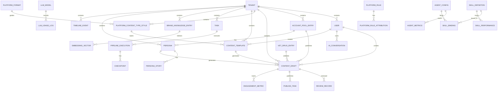

# EcoDream Omni v4.0 — 数据库 ER 图与表结构

> **生成日期**: 2026-06-02
> **版本**: v4.0
> **维护者**: 后端 + DBA
> **定位**: 数据库设计的"法律依据"
> **数据库**: PostgreSQL 16 + pgvector 扩展
> **ORM**: SQLAlchemy 2.0 + Alembic

---

## 一、ER 图（实体关系图）



---

## 二、核心实体表结构

### 2.1 租户与用户层

#### `tenants` — 租户表

| 字段 | 类型 |  nullable | 索引 | 说明 |
|------|------|-----------|------|------|
| `tenant_id` | VARCHAR(64) | NO | PK | 租户唯一标识 |
| `name` | VARCHAR(128) | NO | — | 租户名称 |
| `status` | VARCHAR(32) | NO | IDX | active / suspended / deleted |
| `plan_type` | VARCHAR(32) | NO | — | free / pro / enterprise |
| `created_at` | TIMESTAMPTZ | NO | — | 创建时间 |
| `updated_at` | TIMESTAMPTZ | NO | — | 更新时间 |

#### `users` — 用户表

| 字段 | 类型 | nullable | 索引 | 说明 |
|------|------|----------|------|------|
| `user_id` | VARCHAR(64) | NO | PK | 用户唯一标识 |
| `tenant_id` | VARCHAR(64) | NO | FK + IDX | 所属租户 |
| `username` | VARCHAR(64) | NO | IDX | 用户名 |
| `email` | VARCHAR(128) | NO | IDX | 邮箱 |
| `password_hash` | VARCHAR(256) | NO | — | 密码哈希（Passlib） |
| `role` | VARCHAR(32) | NO | — | admin / operator / viewer |
| `mfa_enabled` | BOOLEAN | NO | — | 是否启用 MFA（Admin 强制） |
| `status` | VARCHAR(32) | NO | — | active / inactive |
| `created_at` | TIMESTAMPTZ | NO | — | 创建时间 |
| `updated_at` | TIMESTAMPTZ | NO | — | 更新时间 |

### 2.2 账号与内容层

#### `account_pool_entries` — 账号池

| 字段 | 类型 | nullable | 索引 | 说明 |
|------|------|----------|------|------|
| `account_id` | VARCHAR(64) | NO | PK | 账号唯一标识 |
| `tenant_id` | VARCHAR(64) | NO | FK + IDX | 所属租户 |
| `platform_id` | VARCHAR(32) | NO | IDX | xhs / douyin / wechat_official / bilibili |
| `platform_account_id` | VARCHAR(64) | NO | — | 平台侧账号 ID |
| `account_name` | VARCHAR(128) | NO | — | 账号显示名称 |
| `status` | VARCHAR(32) | NO | IDX | active / suspended / banned |
| `health_score` | DECIMAL(5,2) | NO | — | 账号健康分（0-100） |
| `proxy_config_id` | VARCHAR(64) | YES | FK | 代理配置 |
| `created_at` | TIMESTAMPTZ | NO | — | 创建时间 |

#### `personas` — 人设档案

| 字段 | 类型 | nullable | 索引 | 说明 |
|------|------|----------|------|------|
| `persona_id` | VARCHAR(64) | NO | PK | 人设唯一标识 |
| `tenant_id` | VARCHAR(64) | NO | FK + IDX | 所属租户 |
| `account_id` | VARCHAR(64) | NO | FK + IDX | 关联账号 |
| `name` | VARCHAR(128) | NO | — | 人设名称 |
| `profile` | JSONB | NO | — | 人设画像（年龄/职业/兴趣等） |
| `tone_preset` | JSONB | YES | — | 语气参数 |
| `story_context` | TEXT | YES | — | 故事线上下文 |
| `status` | VARCHAR(32) | NO | — | active / deprecated |
| `created_at` | TIMESTAMPTZ | NO | — | 创建时间 |

#### `content_drafts` — 内容草稿

| 字段 | 类型 | nullable | 索引 | 说明 |
|------|------|----------|------|------|
| `content_id` | VARCHAR(64) | NO | PK | 内容唯一标识 |
| `tenant_id` | VARCHAR(64) | NO | FK + IDX | 所属租户 |
| `account_id` | VARCHAR(64) | NO | FK + IDX | 发布账号 |
| `title` | VARCHAR(256) | YES | — | 标题 |
| `body` | TEXT | YES | — | 正文 |
| `tags` | JSONB | YES | — | 标签列表 |
| `cover_image_url` | VARCHAR(512) | YES | — | 封面图 URL |
| `platform_id` | VARCHAR(32) | NO | IDX | 目标平台 |
| `content_type` | VARCHAR(32) | NO | — | note_image / note_video 等 |
| `status` | VARCHAR(32) | NO | IDX | idle / generating / reviewing / iterating / approved / published / archived |
| `ai_generation_status` | VARCHAR(32) | YES | — | IDLE / GENERATING / REVIEWING / ITERATING |
| `pipeline_execution_id` | VARCHAR(64) | YES | FK | 关联 Pipeline 执行 |
| `template_id` | VARCHAR(64) | YES | FK | 关联 ContentTemplate |
| `created_by` | VARCHAR(64) | NO | — | 创建者用户 ID |
| `created_at` | TIMESTAMPTZ | NO | — | 创建时间 |
| `updated_at` | TIMESTAMPTZ | NO | — | 更新时间 |

### 2.3 v4.0 新增实体

#### `platform_content_type_styles` — 平台内容类型风格 **（v4.0 新增）**

| 字段 | 类型 | nullable | 索引 | 说明 |
|------|------|----------|------|------|
| `style_id` | VARCHAR(64) | NO | PK | 风格唯一标识（style_xxx） |
| `tenant_id` | VARCHAR(64) | NO | FK + IDX | 所属租户 |
| `platform_id` | VARCHAR(32) | NO | IDX | xhs / douyin / wechat_official / bilibili |
| `content_type` | VARCHAR(32) | NO | IDX | note_image / note_video / video_clone / long_article |
| `content_dna` | JSONB | YES | — | 内容 DNA：{hook_types, structure_patterns, tone_presets} |
| `default_prompt_fragments` | JSONB | YES | — | 默认 Prompt 片段列表 |
| `recommended_keywords` | JSONB | YES | — | 推荐关键词：{high_performing, trending, seasonal} |
| `tone_preset` | JSONB | YES | — | 语气参数：{formality, enthusiasm, urgency, empathy} |
| `structure_template` | JSONB | YES | — | 结构模板：{paragraphs, paragraph_1...} |
| `avg_engagement_rate` | DECIMAL(5,4) | NO | — | 平均互动率 |
| `sample_count` | INTEGER | NO | — | 分析样本数 |
| `is_ai_generated` | BOOLEAN | NO | — | 是否由 AI 分析自动沉淀 |
| `source_template_ids` | JSONB | YES | — | 来源 ContentTemplate ID 列表 |
| `status` | VARCHAR(32) | NO | IDX | active / deprecated / draft |
| `created_by` | VARCHAR(64) | NO | — | 创建者 |
| `created_at` | TIMESTAMPTZ | NO | — | 创建时间 |
| `updated_at` | TIMESTAMPTZ | NO | — | 更新时间 |

**索引设计**：
- `idx_pcstyles_tenant_platform_type`: (`tenant_id`, `platform_id`, `content_type`) — 按租户+平台+类型查询
- `idx_pcstyles_status`: (`status`) — 按状态过滤

#### `content_templates` — 内容模板 **（v4.0 新增）**

| 字段 | 类型 | nullable | 索引 | 说明 |
|------|------|----------|------|------|
| `template_id` | VARCHAR(64) | NO | PK | 模板唯一标识（tmpl_xxx） |
| `tenant_id` | VARCHAR(64) | NO | FK + IDX | 所属租户 |
| `source_platform_id` | VARCHAR(32) | NO | — | 来源平台 |
| `source_content_url` | VARCHAR(512) | YES | — | 源爆款链接 |
| `source_content_id` | VARCHAR(64) | YES | — | 源内容 ID |
| `extracted_structure` | JSONB | NO | — | 解析结构：{hook_pattern, body_structure, cta_pattern} |
| `prompt_template` | TEXT | NO | — | Prompt 模板（含变量占位符） |
| `variables` | JSONB | NO | — | 变量定义：[{name, label, type, default_value}] |
| `engagement_benchmark` | JSONB | YES | — | 源爆款互动数据 |
| `platform_content_type_style_id` | VARCHAR(64) | YES | FK | 关联 PlatformContentTypeStyle |
| `usage_count` | INTEGER | NO | — | 使用次数 |
| `avg_generated_engagement` | JSONB | YES | — | 生成内容的平均互动数据 |
| `status` | VARCHAR(32) | NO | IDX | active / deprecated / draft |
| `created_by` | VARCHAR(64) | NO | — | user / ai |
| `created_at` | TIMESTAMPTZ | NO | — | 创建时间 |
| `updated_at` | TIMESTAMPTZ | NO | — | 更新时间 |

**索引设计**：
- `idx_ctemplates_tenant_status`: (`tenant_id`, `status`) — 按租户+状态查询
- `idx_ctemplates_style`: (`platform_content_type_style_id`) — 按风格查询

### 2.4 Pipeline 与任务层

#### `pipeline_executions` — Pipeline 执行实例

| 字段 | 类型 | nullable | 索引 | 说明 |
|------|------|----------|------|------|
| `execution_id` | VARCHAR(64) | NO | PK | 执行唯一标识 |
| `tenant_id` | VARCHAR(64) | NO | FK + IDX | 所属租户 |
| `template_id` | VARCHAR(64) | NO | FK | 模板 ID |
| `template_version` | INTEGER | NO | — | 模板版本 |
| `status` | VARCHAR(32) | NO | IDX | PENDING / RUNNING / PAUSED / COMPLETED / FAILED |
| `current_node_id` | VARCHAR(64) | YES | — | 当前执行节点 |
| `blackboard_id` | VARCHAR(64) | NO | — | 关联 Blackboard |
| `started_at` | TIMESTAMPTZ | YES | — | 开始时间 |
| `completed_at` | TIMESTAMPTZ | YES | — | 完成时间 |
| `resumed_count` | INTEGER | NO | — | 断点续跑次数 |
| `created_at` | TIMESTAMPTZ | NO | — | 创建时间 |

#### `checkpoints` — 节点级状态快照

| 字段 | 类型 | nullable | 索引 | 说明 |
|------|------|----------|------|------|
| `checkpoint_id` | VARCHAR(64) | NO | PK | 快照唯一标识 |
| `execution_id` | VARCHAR(64) | NO | FK + IDX | 关联 Pipeline 执行 |
| `node_id` | VARCHAR(64) | NO | — | 节点 ID |
| `node_status` | VARCHAR(32) | NO | — | SUCCESS / FAILED / SKIPPED |
| `input_ref` | VARCHAR(256) | YES | — | 输入数据 S3 引用 |
| `output_ref` | VARCHAR(256) | YES | — | 输出数据 S3 引用 |
| `output_summary` | VARCHAR(512) | YES | — | 输出摘要（用于 AI Copilot 展示） |
| `started_at` | TIMESTAMPTZ | NO | — | 开始时间 |
| `completed_at` | TIMESTAMPTZ | YES | — | 完成时间 |
| `latency_ms` | INTEGER | YES | — | 执行延迟 |
| `token_usage` | JSONB | YES | — | Token 消耗：{prompt_tokens, completion_tokens} |
| `is_recoverable` | BOOLEAN | NO | — | 是否可恢复 |
| `created_at` | TIMESTAMPTZ | NO | — | 创建时间 |

### 2.5 Agent 与 Skill 层

#### `agent_configs` — Agent 配置

| 字段 | 类型 | nullable | 索引 | 说明 |
|------|------|----------|------|------|
| `agent_id` | VARCHAR(64) | NO | PK | Agent 唯一标识 |
| `tenant_id` | VARCHAR(64) | NO | FK + IDX | 所属租户 |
| `agent_type` | VARCHAR(32) | NO | IDX | trend_scout / content_forge / compliance_guard 等 |
| `name` | VARCHAR(128) | NO | — | Agent 名称 |
| `status` | VARCHAR(32) | NO | IDX | REGISTERED / ACTIVE / DEGRADED / PAUSED / OFFLINE |
| `config_version` | INTEGER | NO | — | 配置版本 |
| `config_data` | JSONB | NO | — | 配置数据（含 UI 配置、快捷动作等） |
| `adaptive_config` | JSONB | YES | — | 运行时自适应配置 |
| `last_heartbeat_at` | TIMESTAMPTZ | YES | — | 最后心跳时间 |
| `created_at` | TIMESTAMPTZ | NO | — | 创建时间 |
| `updated_at` | TIMESTAMPTZ | NO | — | 更新时间 |

#### `skill_definitions` — Skill 定义

| 字段 | 类型 | nullable | 索引 | 说明 |
|------|------|----------|------|------|
| `skill_id` | VARCHAR(64) | NO | PK | Skill 唯一标识 |
| `tenant_id` | VARCHAR(64) | NO | FK + IDX | 所属租户 |
| `name` | VARCHAR(128) | NO | — | Skill 名称 |
| `version` | VARCHAR(32) | NO | — | 语义化版本 |
| `description` | TEXT | YES | — | Skill 描述 |
| `skill_type` | VARCHAR(32) | NO | — | content_production / system |
| `input_schema` | JSONB | NO | — | 输入参数 JSON Schema |
| `output_schema` | JSONB | NO | — | 输出参数 JSON Schema |
| `modality_support` | JSONB | NO | — | 支持的模态：[text, image, video] |
| `requires_llm` | BOOLEAN | NO | — | 是否需要 LLM |
| `llm_model_preference` | VARCHAR(64) | YES | — | 推荐模型 |
| `estimated_cost_usd` | DECIMAL(10,6) | YES | — | 预估单次调用成本 |
| `required_functions` | JSONB | YES | — | 依赖的 Function API 列表 |
| `data_access_level` | VARCHAR(32) | NO | — | READ_ONLY / WRITE / ADMIN |
| `status` | VARCHAR(32) | NO | IDX | active / deprecated |
| `created_at` | TIMESTAMPTZ | NO | — | 创建时间 |
| `updated_at` | TIMESTAMPTZ | NO | — | 更新时间 |

#### `skill_bindings` — Agent-Skill 绑定

| 字段 | 类型 | nullable | 索引 | 说明 |
|------|------|----------|------|------|
| `binding_id` | VARCHAR(64) | NO | PK | 绑定唯一标识 |
| `agent_id` | VARCHAR(64) | NO | FK + IDX | Agent ID |
| `skill_id` | VARCHAR(64) | NO | FK + IDX | Skill ID |
| `tenant_id` | VARCHAR(64) | NO | FK + IDX | 所属租户 |
| `config_override` | JSONB | YES | — | 绑定级配置覆盖 |
| `priority` | INTEGER | NO | — | 调用优先级 |
| `enabled` | BOOLEAN | NO | — | 是否启用 |
| `created_at` | TIMESTAMPTZ | NO | — | 创建时间 |

### 2.6 LLM 与监控层

#### `llm_models` — LLM 模型配置

| 字段 | 类型 | nullable | 索引 | 说明 |
|------|------|----------|------|------|
| `model_id` | VARCHAR(64) | NO | PK | 模型唯一标识 |
| `tenant_id` | VARCHAR(64) | NO | FK + IDX | 所属租户 |
| `provider` | VARCHAR(32) | NO | IDX | aliyun / openai / anthropic 等 |
| `model_name` | VARCHAR(64) | NO | — | 模型名称：qwen-max / gpt-4o |
| `model_type` | VARCHAR(32) | NO | IDX | text / image / video / embedding / multimodal |
| `modality_support` | JSONB | NO | — | 支持的模态列表 |
| `api_base` | VARCHAR(256) | NO | — | API 基础 URL |
| `api_key_encrypted` | VARCHAR(512) | NO | — | 加密的 API Key |
| `is_fallback` | BOOLEAN | NO | — | 是否为兜底模型 |
| `priority` | INTEGER | NO | — | 路由优先级 |
| `status` | VARCHAR(32) | NO | IDX | active / inactive |
| `created_at` | TIMESTAMPTZ | NO | — | 创建时间 |

#### `llm_usage_logs` — LLM 使用日志

| 字段 | 类型 | nullable | 索引 | 说明 |
|------|------|----------|------|------|
| `log_id` | VARCHAR(64) | NO | PK | 日志唯一标识 |
| `tenant_id` | VARCHAR(64) | NO | FK + IDX | 所属租户 |
| `model_id` | VARCHAR(64) | NO | FK + IDX | 模型 ID |
| `agent_id` | VARCHAR(64) | YES | FK + IDX | 调用 Agent |
| `skill_id` | VARCHAR(64) | YES | FK + IDX | 调用 Skill |
| `prompt_tokens` | INTEGER | NO | — | Prompt Token 数 |
| `completion_tokens` | INTEGER | NO | — | Completion Token 数 |
| `total_tokens` | INTEGER | NO | — | 总 Token 数 |
| `cost_usd` | DECIMAL(10,6) | NO | — | 成本（美元） |
| `latency_ms` | INTEGER | NO | — | 延迟 |
| `modality` | VARCHAR(32) | YES | — | 调用的模态 |
| `quality_feedback` | JSONB | YES | — | 质量反馈评分 |
| `trace_id` | VARCHAR(64) | NO | IDX | 链路追踪 ID |
| `created_at` | TIMESTAMPTZ | NO | IDX | 创建时间 |

### 2.7 其他业务表

#### `brand_knowledge_entries` — 品牌知识库

| 字段 | 类型 | nullable | 索引 | 说明 |
|------|------|----------|------|------|
| `entry_id` | VARCHAR(64) | NO | PK | 条目唯一标识 |
| `tenant_id` | VARCHAR(64) | NO | FK + IDX | 所属租户 |
| `title` | VARCHAR(256) | NO | — | 标题 |
| `content` | TEXT | NO | — | 内容 |
| `content_type` | VARCHAR(32) | NO | — | product / faq / claim / story |
| `embedding` | VECTOR(768) | YES | — | BGE-M3 向量（pgvector） |
| `source` | VARCHAR(128) | YES | — | 来源 |
| `status` | VARCHAR(32) | NO | — | active / archived |
| `created_at` | TIMESTAMPTZ | NO | — | 创建时间 |

**索引设计**：
- `idx_bke_embedding`: 使用 pgvector `ivfflat` 索引（MVP）/ `hnsw`（Phase 2）

#### `engagement_metrics` — 互动数据（DataAnalyst 降级后数据源）

| 字段 | 类型 | nullable | 索引 | 说明 |
|------|------|----------|------|------|
| `metric_id` | VARCHAR(64) | NO | PK | 唯一标识 |
| `tenant_id` | VARCHAR(64) | NO | FK + IDX | 所属租户 |
| `content_id` | VARCHAR(64) | NO | FK + IDX | 关联内容 |
| `account_id` | VARCHAR(64) | NO | FK + IDX | 关联账号 |
| `platform_id` | VARCHAR(32) | NO | IDX | 平台 |
| `likes` | INTEGER | NO | — | 点赞数 |
| `comments` | INTEGER | NO | — | 评论数 |
| `shares` | INTEGER | NO | — | 分享数 |
| `saves` | INTEGER | NO | — | 收藏数 |
| `views` | INTEGER | NO | — | 阅读数 |
| `collected_at` | TIMESTAMPTZ | NO | IDX | 采集时间 |

---

## 三、设计决策与规范

### 3.1 命名规范

| 类型 | 规范 | 示例 |
|------|------|------|
| 表名 | snake_case，复数形式 | `account_pool_entries` |
| 字段名 | snake_case | `created_at` |
| 主键 | `{entity}_id`，VARCHAR(64) | `content_id` |
| 外键 | 引用表主键名 | `tenant_id` |
| 索引名 | `idx_{表缩写}_{字段}` | `idx_ctemplates_tenant_status` |
| JSONB 字段 | 使用 JSONB 存储变长结构化数据 | `content_dna`, `variables` |

### 3.2 通用字段规范

所有业务表必须包含以下字段：

| 字段 | 类型 | 说明 |
|------|------|------|
| `tenant_id` | VARCHAR(64) | 租户隔离（除系统表外） |
| `created_at` | TIMESTAMPTZ | 创建时间（DEFAULT now()） |
| `updated_at` | TIMESTAMPTZ | 更新时间（ON UPDATE now()） |

### 3.3 索引设计原则

1. **所有外键必须建索引**
2. **tenant_id 必须参与复合索引**（租户隔离查询）
3. **状态字段建索引**（频繁按状态过滤）
4. **时间字段建索引**（分页/时间范围查询）
5. **JSONB 字段的常用查询路径建 GIN 索引**

### 3.4 租户隔离策略

```sql
-- 所有业务查询必须带 tenant_id 过滤
SELECT * FROM content_drafts WHERE tenant_id = 'tenant_xxx' AND status = 'published';

-- 禁止不带 tenant_id 的全表查询（除超级管理员外）
-- 应用层通过 SQLAlchemy 查询过滤器自动注入 tenant_id
```

---

## 四、变更记录

| 日期 | 版本 | 变更内容 | 变更人 |
|------|------|---------|--------|
| 2026-06-02 | v1.0 | 初始创建：ER 图 + 26 张核心表结构 + 设计规范 | Kimi Code CLI |

---

*最后更新: 2026-06-02*
*关联文档: `docs/契约与数据/01-API接口契约.md`, `docs/契约与数据/03-核心业务状态流转.md`*
