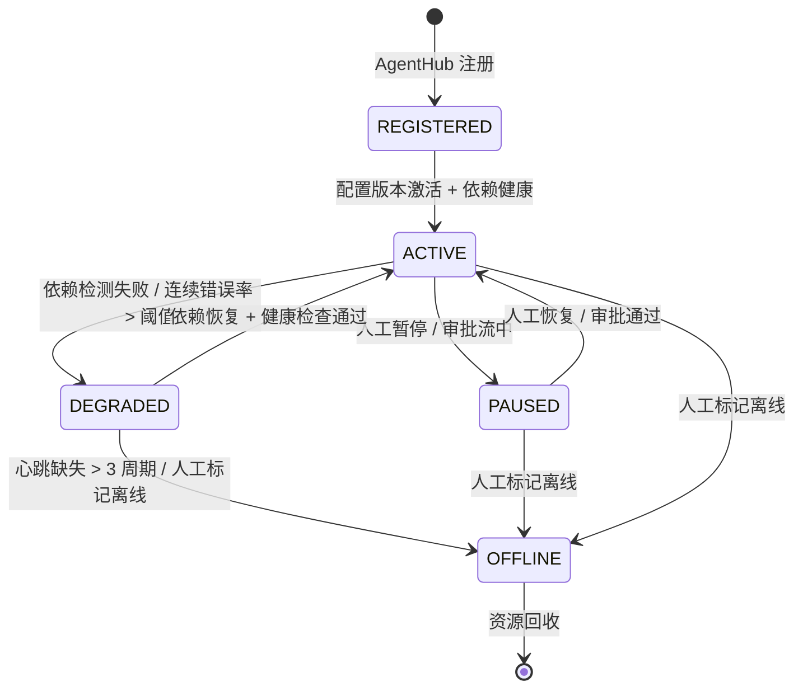
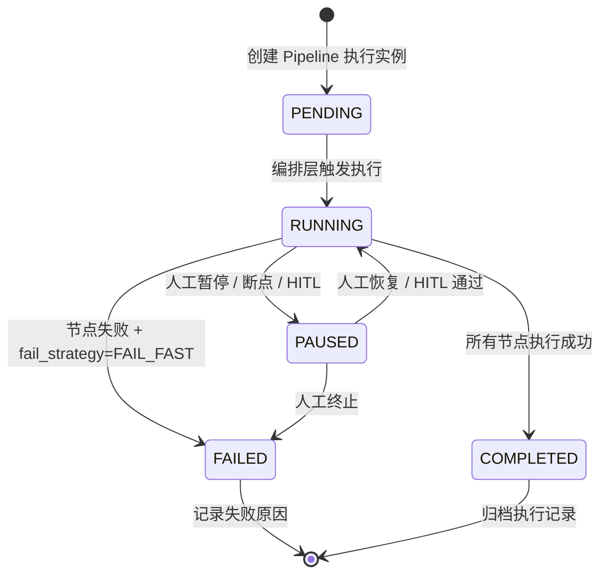
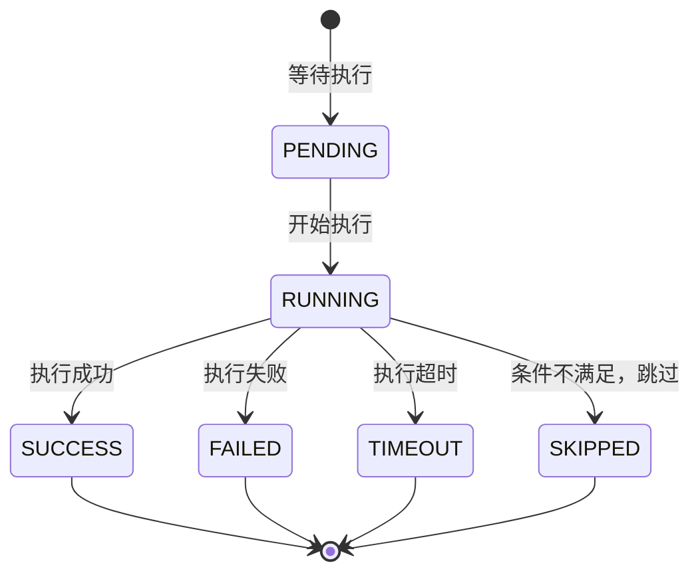
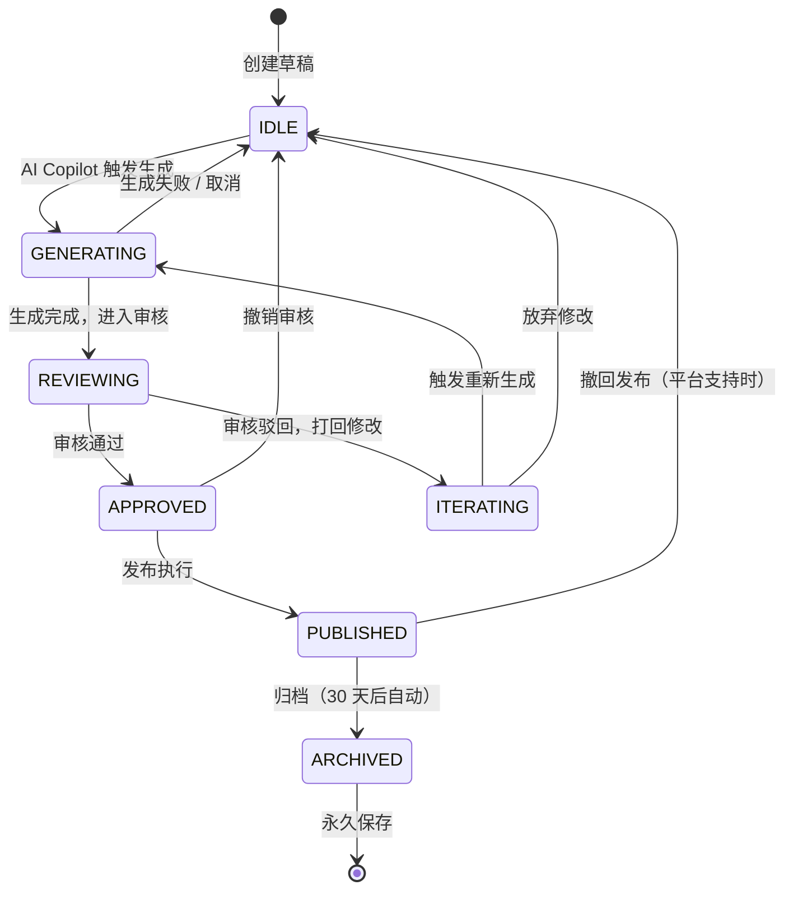
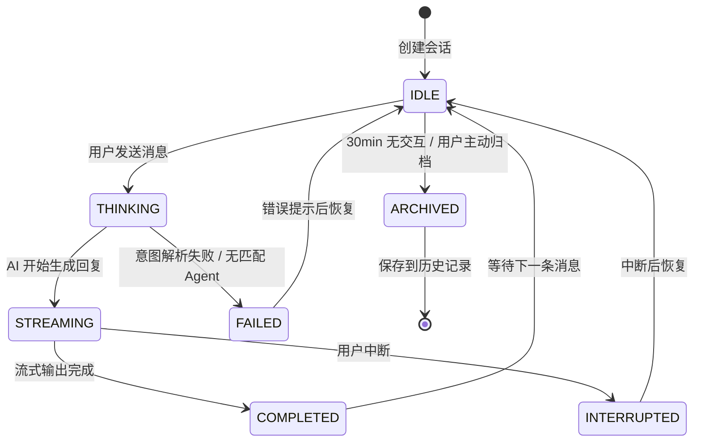

# EcoDream Omni v4.0 — 核心业务状态流转

> **生成日期**: 2026-06-02
> **版本**: v4.0
> **维护者**: 全栈开发者 + 测试工程师
> **定位**: 状态机 Bug 排查的"诊断手册"
> **关联文档**: `docs/契约与数据/01-API接口契约.md`（错误码定义）

---

## 一、状态流转文档目录

本文档定义 EcoDream Omni v4.0 中 4 个核心业务状态机：

| # | 状态机 | 说明 | 所在章节 |
|---|--------|------|---------|
| 1 | **Agent 生命周期状态机** | 10 个常驻 Agent 的运行时状态 | §二 |
| 2 | **Pipeline 执行状态机** | 内容生产 Pipeline 的执行状态 | §三 |
| 3 | **ContentDraft 内容状态机** | 内容草稿从创建到发布的全生命周期 | §四 |
| 4 | **AI Copilot 会话状态机** | AI 对话会话的生命周期 | §五 |

---

## 二、Agent 生命周期状态机

### 2.1 状态定义



### 2.2 状态详细说明

| 状态 | 说明 | 健康检查 | 可执行操作 | 不可执行操作 |
|------|------|---------|-----------|-------------|
| `REGISTERED` | 刚注册，尚未激活 | 跳过 | 无 | 所有业务操作 |
| `ACTIVE` | 正常运行中 | 30s 心跳 | 接收任务、执行 Skill、上报指标 | 无 |
| `DEGRADED` | 降级运行（部分依赖不可用） | 15s 心跳（加速检测） | 只读查询、本地缓存操作 | 写操作、LLM 调用（需降级模型） |
| `PAUSED` | 人工暂停 | 60s 心跳 | 无 | 所有业务操作 |
| `OFFLINE` | 已离线 | 停止心跳 | 无 | 所有业务操作 |

### 2.3 状态转换条件

| 转换 | 触发条件 | 自动/人工 | 副作用 | 超时处理 |
|------|---------|----------|--------|---------|
| REGISTERED → ACTIVE | AgentHub 注册成功 + config_version 激活 + 依赖（LLM/DB/Redis）健康检查通过 | 自动 | 开始 30s 心跳 | 30s 内未激活 → 保持 REGISTERED |
| ACTIVE → DEGRADED | 依赖检测失败（连续 3 次）或 1min 错误率 > 50% | 自动 | 触发 Handoff 到备用 Agent；发布 agent.degraded 事件 | 无 |
| DEGRADED → ACTIVE | 依赖恢复 + 连续 3 次健康检查通过 | 自动 | 停止 Handoff；发布 agent.recovered 事件 | 5min 未恢复 → 保持 DEGRADED |
| DEGRADED → OFFLINE | 心跳缺失 > 3 周期（90s）或人工标记 | 自动/人工 | 发布 agent.offline 事件；从 Fleet 移除 | 无 |
| ACTIVE → PAUSED | 人工暂停按钮 / 审批流中 | 人工 | 正在执行的任务优雅终止；发布 agent.paused 事件 | 无 |
| PAUSED → ACTIVE | 人工恢复按钮 / 审批通过 | 人工 | 发布 agent.resumed 事件 | 无 |
| ACTIVE → OFFLINE | 人工标记离线 | 人工 | 正在执行的任务强制终止；发布 agent.offline 事件 | 无 |

### 2.4 非法状态转换（必须拦截）

```python
ILLEGAL_TRANSITIONS = {
    # 这些转换不允许发生，代码中必须拦截
    ("REGISTERED", "DEGRADED"): "未激活不能直接降级",
    ("REGISTERED", "PAUSED"): "未激活不能暂停",
    ("REGISTERED", "OFFLINE"): "未激活不能离线（应先激活再离线）",
    ("OFFLINE", "ACTIVE"): "离线后不能直接激活（需重新注册）",
    ("OFFLINE", "DEGRADED"): "离线后不能直接降级",
    ("OFFLINE", "PAUSED"): "离线后不能暂停",
    ("PAUSED", "DEGRADED"): "暂停中不能降级",
    ("DEGRADED", "PAUSED"): "降级中不能暂停（应先恢复再暂停）",
}
```

### 2.5 状态存储

| 存储位置 | 用途 | TTL |
|---------|------|-----|
| PostgreSQL `agent_configs.status` | 持久化状态 | 永久 |
| Redis `agent:{agent_id}:state` | 运行时热状态 | 2min（心跳续期） |
| Redis Streams `agent.events` | 状态变更事件 | 7 天 |

---

## 三、Pipeline 执行状态机

### 3.1 状态定义



### 3.2 节点状态定义

每个 Pipeline 节点有独立的状态：



### 3.3 标准 Pipeline 10 步状态流转

```
[START]
  │
  ▼
Step 1: TrendScout ──→ PENDING → RUNNING → SUCCESS
  │                                              │
  ▼                                              │
Step 2: MarketingMethodology ──→ PENDING → RUNNING → SUCCESS
  │                                                     │
  ▼                                                     │
Step 3: brand_knowledge_inject ──→ PENDING → RUNNING → SUCCESS
  │                                                       │
  ▼                                                       │
Step 4: vetdrug_validate ──→ PENDING → RUNNING → SUCCESS
  │                                                 │
  ▼                                                 │
Step 5: keyword_inject ──→ PENDING → RUNNING → SUCCESS  ← v4.0 新增
  │                                               │
  ▼                                               │
Step 6: ContentForge ──→ PENDING → RUNNING → SUCCESS
  │                                             │
  ▼                                             │
Step 7: ImageForge ──→ PENDING → RUNNING → SUCCESS/FAILED (fail_strategy: CONTINUE)
  │                                           │
  ▼                                           │
Step 8: ComplianceGuard ──→ PENDING → RUNNING → SUCCESS
  │                                                │
  ▼                                                │
Step 9: PoolPredictor ──→ PENDING → RUNNING → SUCCESS (fail_strategy: CONTINUE)
  │                                              │
  ▼                                              │
Step 10: Human-in-the-Loop ──→ PENDING → RUNNING → PAUSED
  │                                                    │
  │  人工审核通过 ──→ RUNNING → SUCCESS                  │
  │  人工审核驳回 ──→ FAILED                            │
  ▼                                                    │
Step 11: Publisher ──→ PENDING → RUNNING → SUCCESS
  │                                         │
  ▼                                         │
Step 12: engagement_collect ──→ PENDING → RUNNING → SUCCESS (24h 后)
  │                                                │
  ▼                                                │
[COMPLETED]
```

### 3.4 断点续跑机制

```
场景：Step 6 (ContentForge) 执行时 LLM 超时失败

执行前状态：
  Step 1-5: SUCCESS ✅
  Step 6: FAILED ❌ (超时)
  Step 7-12: PENDING ⏳

用户操作：点击"从断点恢复"

恢复后执行：
  Step 1-5: SKIPPED ⏭️（读取 Checkpoint，不再执行）
  Step 6: RUNNING 🔄（重试）
  Step 7-12: PENDING ⏳（继续执行）
```

### 3.5 fail_strategy 行为矩阵

| fail_strategy | 节点失败时行为 | 适用节点 |
|--------------|--------------|---------|
| `FAIL_FAST` | 立即停止整个 Pipeline，标记 FAILED | ComplianceGuard（合规红线） |
| `CONTINUE` | 跳过失败节点，继续执行后续节点 | PoolPredictor（预测失败不影响发布） |
| `RETRY_THEN_FAIL` | 重试 3 次（指数退避），仍失败则 FAIL_FAST | ContentForge（生成失败可重试） |

### 3.6 非法状态转换（必须拦截）

```python
ILLEGAL_PIPELINE_TRANSITIONS = {
    ("PENDING", "COMPLETED"): "不能直接完成，必须经过 RUNNING",
    ("RUNNING", "PENDING"): "不能回退到 PENDING",
    ("COMPLETED", "RUNNING"): "已完成不能重新运行（需新建执行）",
    ("FAILED", "RUNNING"): "失败不能重新运行（需 resume 或新建）",
    ("FAILED", "COMPLETED"): "失败不能直接完成",
}
```

---

## 四、ContentDraft 内容状态机

### 4.1 状态定义



### 4.2 状态详细说明

| 状态 | 说明 | 前端展示 | 可执行操作 |
|------|------|---------|-----------|
| `IDLE` | 空闲草稿 | 灰色卡片，"草稿"标签 | 编辑、删除、触发 AI 生成 |
| `GENERATING` | AI 生成中 | 紫色脉冲边框，"生成中"标签 | 取消生成 |
| `REVIEWING` | 审核中 | 黄色边框，"审核中"标签 | 查看详情、通过、驳回 |
| `ITERATING` | 迭代修改中 | 橙色边框，"修改中"标签 | 编辑、重新生成、放弃 |
| `APPROVED` | 已通过 | 绿色边框，"已通过"标签 | 立即发布、定时发布、撤销 |
| `PUBLISHED` | 已发布 | 蓝色边框，"已发布"标签 | 查看数据、撤回（如支持）、归档 |
| `ARCHIVED` | 已归档 | 灰色（低对比度），"已归档"标签 | 查看、恢复 |

### 4.3 状态转换触发条件

| 转换 | 触发者 | 触发条件 | 副作用 |
|------|--------|---------|--------|
| IDLE → GENERATING | 用户 / AI Copilot | 用户点击"生成"或 AI Copilot 指令 | 创建 Pipeline 执行；展示"生成中"卡片 |
| GENERATING → REVIEWING | Pipeline | ContentForge 成功完成 | Inline AI 建议浮现；AI Copilot 推送审核提示 |
| GENERATING → IDLE | 用户 / 系统 | 用户点击"取消"或 Pipeline FAIL_FAST | 保留已生成内容（如有），状态回退 |
| REVIEWING → APPROVED | 用户（运营） | 点击"通过"按钮 | 内容锁定（不可编辑）；进入待发布队列 |
| REVIEWING → ITERATING | 用户（运营） | 点击"驳回"按钮 | 记录驳回原因；内容可编辑 |
| ITERATING → GENERATING | 用户 / AI Copilot | 点击"重新生成"或应用 AI 建议 | 创建新的 Pipeline 执行 |
| ITERATING → IDLE | 用户 | 点击"放弃修改" | 状态回退，保留原草稿 |
| APPROVED → PUBLISHED | Publisher Agent | 执行平台发布 API 成功 | ContentCard 状态更新；记录发布时间和平台链接 |
| APPROVED → IDLE | 用户 | 点击"撤销审核" | 内容解锁，可编辑 |
| PUBLISHED → ARCHIVED | 系统（定时任务） | 发布后 30 天自动归档 | 内容移入归档区 |

### 4.4 与 Pipeline 状态的联动

```
ContentDraft.status          PipelineExecution.status
─────────────────            ────────────────────────
IDLE                         —（无 Pipeline）
GENERATING                   RUNNING / PAUSED
REVIEWING                    COMPLETED（Step 10 完成）
ITERATING                    —（Pipeline 已结束）
APPROVED                     —（Pipeline 已结束）
PUBLISHED                    —（Pipeline 已结束）
ARCHIVED                     —（Pipeline 已结束）
```

> **关键规则**：ContentDraft 进入 `GENERATING` 时，必须关联一个 `RUNNING` 状态的 PipelineExecution。如果 PipelineExecution 变为 `FAILED`，ContentDraft 状态应回退到 `IDLE` 或 `ITERATING`。

---

## 五、AI Copilot 会话状态机

### 5.1 状态定义



### 5.2 状态详细说明

| 状态 | 说明 | 前端展示 | 可执行操作 |
|------|------|---------|-----------|
| `IDLE` | 空闲等待 | 输入框可输入 | 发送消息、选择快捷动作 |
| `THINKING` | AI 思考中 | 输入框禁用，显示"思考中..." | 取消 |
| `STREAMING` | 流式输出中 | SSE chunk 逐字显示 | 中断输出 |
| `COMPLETED` | 输出完成 | 完整消息展示，Action Cards 浮现 | 应用建议、继续对话 |
| `FAILED` | 生成失败 | 错误提示卡片 | 重试、反馈 |
| `INTERRUPTED` | 用户中断 | 显示已输出部分 + "已中断"标记 | 继续生成、重新输入 |
| `ARCHIVED` | 已归档 | 从活跃会话列表移除 | 从历史记录恢复 |

### 5.3 与 Agent/Pipeline 的联动

```
AI Copilot 会话状态          底层执行
────────────────────         ─────────
THINKING                     Meta-Orchestrator 意图解析
STREAMING                    Agent 执行中 / SSE 流式推送
COMPLETED                    Agent 执行完成 / Pipeline 完成
FAILED                       Agent 执行失败 / Pipeline FAILED
```

---

## 六、状态机实现规范

### 6.1 状态变更日志

所有状态变更必须记录到审计日志：

```python
class StateChangeLog(BaseModel):
    log_id: str
    entity_type: str           # agent / pipeline / content_draft / ai_conversation
    entity_id: str
    from_status: str
    to_status: str
    trigger: str               # user_action / system_auto / agent_event / timeout
    trigger_detail: str        # 具体触发原因
    operator_id: Optional[str] # 操作者（用户操作时为 user_id）
    context: Dict              # 状态变更时的上下文
    created_at: datetime
```

### 6.2 状态校验装饰器

```python
def validate_state_transition(entity_type: str, allowed_transitions: Dict[Tuple[str, str], str]):
    """状态转换校验装饰器"""
    def decorator(func):
        def wrapper(self, entity_id: str, to_status: str, *args, **kwargs):
            entity = self.get(entity_id)
            from_status = entity.status
            
            if (from_status, to_status) not in allowed_transitions:
                raise IllegalStateTransitionError(
                    f"非法状态转换: {entity_type} {entity_id} "
                    f"不能从 {from_status} 转换到 {to_status}"
                )
            
            # 执行转换
            result = func(self, entity_id, to_status, *args, **kwargs)
            
            # 记录日志
            self.log_state_change(entity_id, from_status, to_status)
            
            return result
        return wrapper
    return decorator
```

### 6.3 前端状态展示规范

| 状态类型 | 颜色 | 图标 | 动画 |
|---------|------|------|------|
| 运行中 / 生成中 | 紫色 (`#A371F7`) | `Loader2` | 脉冲边框 |
| 成功 / 已通过 | 绿色 (`#3FB950`) | `CheckCircle` | 无 |
| 失败 | 红色 (`#F85149`) | `XCircle` | 无 |
| 警告 / 降级 | 黄色 (`#D29922`) | `AlertTriangle` | 无 |
| 暂停 / 等待 | 蓝色 (`#58A6FF`) | `PauseCircle` | 呼吸动画 |
| 归档 | 灰色 (`#71717A`) | `Archive` | 无 |

---

## 七、常见问题排查

### Q1: Agent 卡在 DEGRADED 状态无法恢复
**排查步骤**：
1. 检查 Agent 依赖健康（LLM / DB / Redis）
2. 检查 Agent 日志中的错误原因
3. 检查 Handoff 是否成功（备用 Agent 是否接管）
4. 如果 5min 未自动恢复，人工干预：ACTIVE → OFFLINE → 重新 REGISTERED

### Q2: Pipeline 卡在 RUNNING 状态但节点无响应
**排查步骤**：
1. 检查当前执行节点的 Checkpoint 最后更新时间
2. 如果 > 2min 未更新，判定为节点僵死
3. 触发节点超时处理（TIMEOUT → 按 fail_strategy 处理）
4. 如果 fail_strategy=CONTINUE，Pipeline 继续执行后续节点

### Q3: ContentDraft 在 GENERATING 状态但 Pipeline 已 FAILED
**排查步骤**：
1. 检查 ContentDraft 与 PipelineExecution 的关联是否正确
2. Pipeline FAILED 时应触发 ContentDraft 状态回退（→ IDLE 或 ITERATING）
3. 如果未触发，检查 Pipeline 回调逻辑是否完善

---

## 八、变更记录

| 日期 | 版本 | 变更内容 | 变更人 |
|------|------|---------|--------|
| 2026-06-02 | v1.0 | 初始创建：4 个状态机定义 + 非法转换拦截 + 实现规范 + 排查手册 | Kimi Code CLI |

---

*最后更新: 2026-06-02*
*关联文档: `docs/契约与数据/01-API接口契约.md`, `docs/契约与数据/02-数据库ER图.md`*
