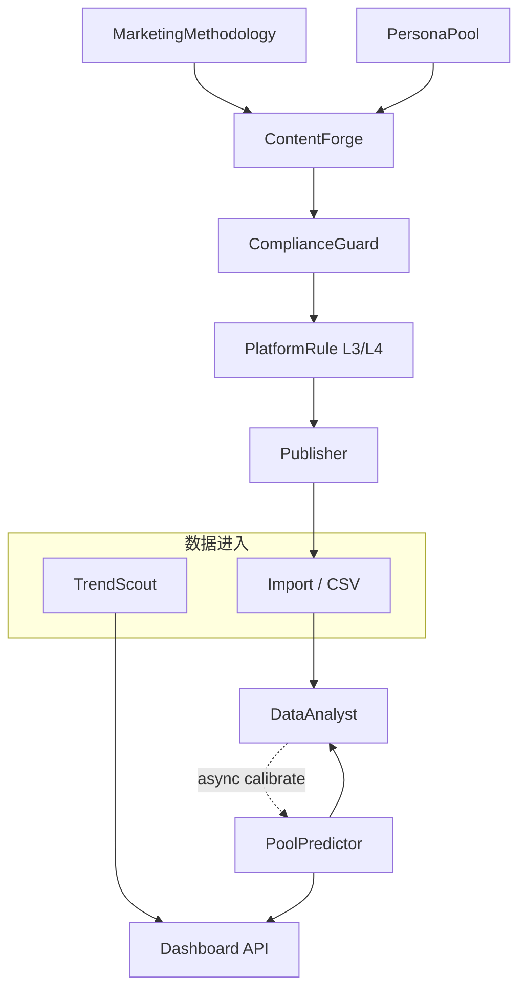

# EcoDream Omni 详细设计说明书（Final v1.0）

| 属性 | 内容 |
|------|------|
| **真源需求** | `EcoDream_Omni_PRD_v2_对齐核心方案.md`（**V2.3**） |
| **真源排期** | `开发计划_素人号矩阵AI平台_v2.md`（**v2.2**） |
| **实现仓库** | `apps/backend`（FastAPI）、`apps/frontend`（React 19 + Vite 6） |
| **版本** | v1.0（2026-05-13） |
| **状态** | 已纳入架构—稳定性—可实现性评审结论，可作为 W11–W14 与后续 Phase 实施依据 |

---

## 〇、架构—稳定性—可实现性评审摘要

### 0.1 评审维度与结论

| 维度 | 结论 | 设计中的落实方式 |
|------|------|------------------|
| **架构合理性** | **通过（附条件）** | 保持「API → Service → Model」洋葱模型；预测、合规、发布、回流**解耦**；跨模块仅通过 **Service 接口 + 明确 DTO** 调用，禁止循环依赖。条件：`meta_learner` 路由与 PRD 废弃清单冲突，**冻结为只读/deprecated**，新功能不得依赖（见 §7.10）。 |
| **稳定性** | **通过（附边界）** | 自建 API SLO 与第三方（LLM、平台站点、住宅代理）**分离声明**；连接器 **熔断 + 降级到导入**；预测 **同步路径**仅做轻量推断，**校准 / 重训**走异步队列占位（Celery 或等效后台任务表）。 |
| **可实现性** | **通过** | MVP 补全严格采用 PRD §2.6：**导入优先回流**、`N_min` 子集考核覆盖率、`interval_mode` 区分先验/拟合；禁止无人值守全矩阵爬取与未验证因果增幅 UI。 |

### 0.2 评审中识别的风险与处置（已写入正文）

1. **平台无官方互动指标 API**：实际互动以 **CSV/表单导入** 为一等公民；Playwright 只读为 **可选插件**，默认关闭或 feature flag。  
2. **预测小样本过拟合**：MVP 强制 **宽先验 + QuantileRegressor/分段先验**；XGBoost+SHAP 仅 **W18 / Phase 2** 且 gated by `N_min`。  
3. **合规证据链存储膨胀**：采用 **追加写 + 分区/归档策略**（实现期由 Alembic 迁移定义；MVP 可先表结构 + 异步归档任务占位）。  
4. **Publisher 与 L3 规则耦合复杂度**：Publisher 在出队前 **调用 platform_rule_service 只读快照**（带版本号），规则变更不中断已排队任务，仅影响新队列。

---

## 一、系统目标与范围

### 1.1 业务目标（来自 PRD）

在 **20 账号** MVP 尺度下闭环：**选题 → 生成 → 互动量区间预演 → 合规 → 发布 → 实际互动对齐（导入为主）→ 异步校准建议**。

### 1.2 设计范围（本说明书覆盖）

| 范围 | 说明 |
|------|------|
| **In** | W1–W10 已交付模块的**增强契约**；**W11–W14** MVP 补全的接口、模型、服务边界、错误与降级；驾驶舱与 PRD §3 对齐的展示约束。 |
| **Out（本版不展开 DDL）** | Phase 2 SkillHub/SkillSmith/IP 信誉/ContentInsight 的完整 DDL——仅保留**接口依赖方向**；Harness H1–H6 仅保留**与现有 Service 的挂载点**。 |

### 1.3 技术栈（冻结）

- **后端**：Python 3.11、FastAPI、Uvicorn、Pydantic v2、SQLAlchemy 2.0、Alembic、pytest。  
- **前端**：React 19、TypeScript、Vite 6、Tailwind v4、Zustand、TanStack Query、Vitest、RTL。  
- **数据**：PostgreSQL 16、Redis 7（会话、Cookie、可选队列、限流计数）。  
- **ML**：`scikit-learn`（MVP 主路径）；`xgboost`/`shap`/`statsmodels` 为 Phase 2+（vendor 已备）。  
- **LLM 网关**：LiteLLM + 自研路由配置（实现渐进接入，本设计只约束**不得阻塞核心写路径**）。

---

## 二、逻辑架构

### 2.1 分层视图

```
Client (Browser)
    → apps/frontend (BFF 调用模式：直连同源 API 或经网关)
    → apps/backend/src/api/*        # 路由：校验、鉴权、DTO 映射
    → apps/backend/src/services/*   # 业务规则、编排、事务边界
    → apps/backend/src/models/*     # ORM / 持久化
    → PostgreSQL / Redis
```

**原则**：`api` 层不实现业务规则；`services` 不直接处理 HTTP；跨服务调用禁止从 `api` 穿透到另一模块 `models`。

### 2.2 模块依赖（有向、无环）



---

## 三、横切设计

### 3.1 认证与授权

- **JWT**：沿用 `src/core/security.py` + `dependencies.get_current_user`。  
- **角色**：`admin` / `operator` / `compliance` 等（以 `User.role` 为准）；**PlatformRule 写操作**仅 `admin`（PRD §2.5）。  
- **租户**：若当前模型无 `tenant_id`，W14 前在迁移中增加**可空默认租户**，避免多租户 Phase 3 时大改 API。

### 3.2 API 约定

- **前缀**：保持 `main.py` 现有 `include_router` 路径；新增资源使用 **复数名词** + **kebab-case** 与 PRD 一致（如 `/trend-scout/reports`）。  
- **错误体**：`{"detail": str | list}`（FastAPI 默认）+ 业务错误码扩展字段 `code`（可选，由 middleware 统一注入）。  
- **幂等**：导入类 `POST` 支持 `Idempotency-Key` header（UUID）；重复 key 返回 **409** 或已有 `report_id`（实现二选一，须在 OpenAPI 注明）。

### 3.3 可观测性（MVP 最低）

- **结构化日志**：`content_id`、`account_id`、`request_id`（middleware 生成）。  
- **指标**：`/health` 已存在；建议增加 `predictions_latency_ms`、`import_rows_total`（实现期 Prometheus 可选）。

### 3.4 SLO 边界（与 PRD §2.6 C 对齐）

| SLO | 范围 | 不包含 |
|-----|------|--------|
| API 可用性 | 自建 `EcoDreamOmni API` | 第三方 LLM、小红书站点、代理池 |
| 发布成功率 | 可重试失败重试后成功 | 账号封禁、平台改 DOM 导致不可恢复失败 |

---

## 四、数据架构原则

### 4.1 表分组（逻辑）

| 分组 | 代表实体 |
|------|-----------|
| **Identity** | `users`、会话相关 |
| **Matrix** | `accounts`、指纹、健康、平台 Cookie |
| **Content** | 草稿、正文版本、`parent_content_id`（再生成链） |
| **Governance** | 合规记录、**platform_rules**（L1–L4 分层字段 `layer`） |
| **Analytics** | `predictions`、`data_reports`、导入原始行（可 staging 表） |
| **Ops** | 发布任务、调度队列 |

### 4.2 迁移策略

- **仅向前迁移**：Alembic；禁止回滚已上生产迁移中的**删列**。  
- **大表归档**：合规证据链表按 `created_at` 月分区或定期导出对象存储（Phase 2 实施，本设计预留字段 `archived_at`）。

---

## 五、模块详细设计

### 5.1 PoolPredictor（增强，对齐 PRD §2.4）

**职责**：基于内容与账号特征输出 **likes / comments / saves** 三区间的 `lower|median|upper`，并返回 `interval_mode`、`confidence`（启发式）。

**接口**（在现有 `pool_predictor` router 上扩展响应 schema，保持向后兼容）：

- `POST /predictions`：请求体含 `content_text`、`tags[]`、`account_id`、可选 `methodology_stage_id`。  
- 响应字段（最小集）：`likes`、`comments`、`saves` 各 `{lower, median, upper}`，`interval_mode`，`confidence`，`feature_version`。

**算法路径**：

1. 特征抽取（Python）：长度、标签数、时段 one-hot、账号历史聚合等；缺失维 **默认值 + 降权标记**。  
2. `interval_mode=prior`：`N_posts_effective < N_min` 或配置强制先验。  
3. `interval_mode=fitted`：`QuantileRegressor` 或等效（每个指标独立或多输出封装）。  
4. **禁止**响应字段：`l0_l5_distribution`、`ces_point_estimate` 作为默认 UI 源。

**稳定性**：单次 P95 目标 **小于 500ms**（不含 LLM）；若超时返回 `prior` 降级并打日志。

---

### 5.2 TrendScout（W11，PRD §2.1）

**职责**：Mock / 导入驱动的趋势报告；人设草案 **非爬虫**。

**接口**：

| 方法 | 路径 | 说明 |
|------|------|------|
| POST | `/trend-scout/reports` | body：`query`, `stage_filter`, `items[]`（可选导入） |
| GET | `/trend-scout/reports` | 分页 |
| GET | `/trend-scout/reports/{id}` | 详情 |
| POST | `/trend-scout/persona-draft` | 结构化要点 → 草案（可调用 LLM，**异步可选**） |

**持久化**：`trend_reports` 表（id, tenant_id, query, stage_filter, payload_json, source=mock|import, created_at）。

**降级**：LLM 不可用时返回 **规则模板拼装** 的草案 + `warnings[]`。

---

### 5.3 MarketingMethodology（W12，PRD §2.2 + §2.6 S0）

**职责**：AIPL 阶段定义、模板、评估。

**接口**：

| 方法 | 路径 | 说明 |
|------|------|------|
| GET | `/methodologies` | 列表 |
| GET | `/methodologies/{id}/stages` | 阶段列表 |
| GET | `/methodologies/stages/{stage_id}/template` | `hook/body/cta/disclaimer` JSON Schema + 默认值 |
| POST | `/methodologies/stages/{stage_id}/evaluate` | 输入正文 → `missing_fields[]`、`score` |

**与 ContentForge 集成**：`POST /content-forge/generate` 增加可选 `stage_id`；Service 层在拼 prompt 前 `GET template` 并注入 **可审计** `template_version`。

**前端同源校验**：从 `packages/shared` 或生成 OpenAPI 客户端类型，与 Zod schema **字段名一致**（S0）。

---

### 5.4 DataAnalyst（W13，PRD §2.3）

**职责**：对齐预测 vs 实际、MAPE、覆盖率（**N_min 门禁**）、异步校准建议。

**接口**：

| 方法 | 路径 | 说明 |
|------|------|------|
| POST | `/data-analyst/reports` | 支持 `multipart/form-data` CSV 或 JSON 行 |
| GET | `/data-analyst/reports/{id}` | |
| GET | `/data-analyst/dashboard` | 聚合 |
| GET | `/data-analyst/attribution/{content_id}` | |
| POST | `/data-analyst/calibrate` | 写 `calibration_jobs` 表或入队 |

**核心逻辑**：

- `prediction_comparison` 从 `predictions` 表按 `content_id` + 最近版本拉取。  
- `coverage_kpi_applicable = (count(valid_rows) >= N_min)`。  
- **禁止**同步重训：校准任务状态 `pending|running|done|failed`。

---

### 5.5 PlatformRule L3/L4（W14，PRD §2.5）

**职责**：可配置规则 + 违规归因；与 Publisher、Compliance **只读耦合**。

**模型字段（建议）**：`id`, `layer` (enum: l1,l2,l3,l4), `name`, `condition_json`, `action` (block|warn|suggest), `priority`, `enabled`, `version`, `effective_from`, `created_by`。

**接口**：PRD 所列 CRUD + `GET /platform-rules/attribution/{content_id}`。

**Publisher 集成**：调度前 `evaluate_l3(account_id, proposed_publish_at)` → 调整延迟或拒绝并入 `publish_skipped_reason`。

---

### 5.6 ComplianceGuard 证据链（W14 子集）

- 每次 **L1 拦截 / L2 警告** 写入 `compliance_audit`：`content_id`, `layer`, `rule_id`, `snippet_hash`, `payload_ref`, `created_at`。  
- **不可变**：应用层禁止 `UPDATE`；纠错通过 **新追加行** `superseded_by`。

---

### 5.7 Publisher 与 L3 对齐（W14 子集）

- 读取 **当日已发计数**（Redis INCR + TTL 或 DB 聚合，二选一并文档化）。  
- **频率阶梯**：配置表驱动（与文档2 新号/成长期/老号一致），账号属性来自 AccountPool。

---

### 5.8 Dashboard / 前端（PRD §3）

- **流量预演**：只展示 §5.1 字段；`prior` 显示「参考区间」标签。  
- **昨日战报**：数据源 **DataAnalyst dashboard**；无导入时展示空态 + 引导 CSV。  
- **智能选题**：TrendScout 列表入口。

---

### 5.9 Pipeline / E2E

- 在 `pipeline_service` 增加可选步骤：`methodology_evaluate`（可跳过）→ `predict` → `compliance` → …；每步输出写入 **run 记录** 便于排障。

---

### 5.10 meta_learner（技术债声明）

- **与 PRD 废弃清单冲突**；本版本详细设计**不扩展**该模块。  
- **建议**：后续 Sprint 将路由 **403 for non-admin** 或 **feature_flag=off** 默认关闭，文档与 OpenAPI 标注 `deprecated`，逻辑迁移至 **SkillSmith + 审计数据**（开发计划 §1.3）。

---

## 六、异步与队列

| 任务 | 触发 | 实现选项 |
|------|------|----------|
| 模型校准检查 | `POST /data-analyst/calibrate` 或定时 | Celery task 或 `calibration_jobs` + worker 进程 |
| 归档合规审计 | 定时 | 同上 |

**约束**：异步 worker **不得**持有平台 Cookie 长连接；与 Playwright 发布队列 **资源隔离**。

---

## 七、安全与合规

- **PII**：导入 CSV 仅允许运营角色；下载脱敏。  
- **密钥**：Redis 中 Cookie 已 AES；规则与迁移中不出现明文密钥。  
- **内容红线**：L1 规则变更须双人复核（流程上，实现可为 `admin` + audit log）。

---

## 八、测试与质量门禁

- 每模块 **pytest** 覆盖 PRD §4.1 场景；PoolPredictor 断言 **含区间字段**。  
- 覆盖率门槛见 `AGENTS.md`（≥80% 新增行）。  
- E2E：`test_e2e.py` 增加「预测含 `interval_mode`」断言（与详细设计 §5.1 一致）。

---

### 5.11 AgentHub — Agent 管理与配置中心（PRD V2.4 §7.2，W15）

**定位**：所有业务 Agent（TrendScout、ContentForge、ComplianceGuard、Publisher、DataAnalyst、PoolPredictor、MarketingMethodology、PlatformRule、Orchestrator）的统一注册发现与配置治理中心。

**核心能力**：
1. **注册与发现**：Agent 启动时向 AgentHub 注册；MVP 仅支持手动注册，Phase 2 扩展服务发现。
2. **配置版本化**：每个 Agent 的配置（prompt 模板、LLM 路由、超时、重试）以版本化快照存储；支持 `DRAFT / ACTIVE / ARCHIVED / ROLLED_BACK` 四态；禁止无版本记录的在线热改。
3. **环境隔离**：`dev / staging / prod` 多环境配置隔离；发布流程为「草稿 → staging 灰度 → prod 全量」。
4. **权限 RBAC**：区分 Orchestrator 调用权限与运营人员只读权限；敏感 Agent（Publisher、ComplianceGuard）须双人复核或审批流。
5. **依赖声明**：LLM / Tool / DataSource 三类型依赖；依赖缺失或降级时 Agent 状态自动置为 `degraded`。

**数据模型**：
- `AgentRegistration`：id, name, role, description, owner, status, created_at, updated_at
- `AgentConfigSnapshot`：id, agent_id, version, env, config_payload, checksum(SHA-256), created_by, status, approval_status
- `AgentDependency`：agent_id, dep_type, dep_name, dep_status, last_check, failover_config
- `AgentPermission`：agent_id, principal, principal_type, actions, granted_by, expires_at

**API**：
- `POST /agent-hub/agents` — 注册
- `GET /agent-hub/agents` — 列表（status / role / env 过滤）
- `GET /agent-hub/agents/{id}` — 详情（含当前生效配置版本）
- `PATCH /agent-hub/agents/{id}` — 更新元数据
- `DELETE /agent-hub/agents/{id}` — 软删除
- `POST /agent-hub/agents/{id}/configs` — 创建新版本
- `POST /agent-hub/agents/{id}/configs/{ver}/activate` — 激活版本
- `POST /agent-hub/agents/{id}/configs/{ver}/rollback` — 回滚
- `GET /agent-hub/agents/{id}/dependencies` — 依赖清单
- `GET /agent-hub/approvals` — 审批流列表

---

### 5.12 AgentWatch — Agent 活跃监控与异常检测（PRD V2.4 §7.3，W15–W16）

**定位**：Agent 运行时可观测性层；基于 OpenTelemetry 标准采集 trace，基于规则引擎检测异常。

**核心能力**：
1. **心跳与健康**：Agent 每 30s 上报心跳；缺失超过 3 个周期标记为 `UNHEALTHY`；Orchestrator 调度前强制检查目标 Agent 健康状态。
2. **实时状态看板**：展示 Agent 当前状态（空闲 / 运行中 / 故障 / 熔断）、当前任务、队列堆积数。
3. **链路追踪**：基于 OpenTelemetry，一次 Pipeline（选题→生成→合规→预演→发布→回流）生成统一 `trace_id`；每个 Agent 调用为一个 `span`，含输入摘要、输出摘要、耗时、Token 数、模型版本。MVP 仅采集与存储，不要求实时链路图。
4. **异常检测（规则引擎）**：
   - **循环检测**：同一 Agent 在 5 分钟内对同一 `content_id` 重复调用 ≥3 次 → `LOOP_ALERT`
   - **超时检测**：单 Agent 执行超过配置阈值 → `TIMEOUT_ALERT`
   - **工具失败**：外部 Tool 连续失败 ≥3 次 → `TOOL_DEGRADED`，通知 AgentHub 更新依赖状态
   - **成本异常**：单任务 Token 消耗超过同类任务 p95 的 200% → `COST_ANOMALY`（Phase 2）
5. **告警分级**：P0（Publisher 失败、ComplianceGuard 绕过）→ 即时电话/短信；P1（Agent 离线、工具降级）→ 企业微信；P2（成本异常、质量漂移）→ 邮件日报。

**数据模型**：
- `AgentHeartbeat`：agent_id, timestamp, status, current_task_id, queue_depth, version
- `AgentTrace`：trace_id, content_id, pipeline_type, start_time, end_time, status, total_tokens, total_cost_usd
- `AgentSpan`：span_id, trace_id, parent_span_id, agent_id, agent_role, duration_ms, status, input_summary, output_summary, token_count, model_version, tool_calls
- `AgentAlert`：id, severity, alert_type, agent_id, trace_id, content_id, message, status, acked_by, root_cause

**API**：
- `POST /agent-watch/heartbeat` — Agent 上报心跳
- `GET /agent-watch/agents/{id}/status` — 实时状态
- `GET /agent-watch/dashboard` — 全量 Agent 状态聚合
- `GET /agent-watch/traces` — 链路列表
- `GET /agent-watch/traces/{trace_id}` — 链路详情
- `GET /agent-watch/alerts` — 告警列表
- `PATCH /agent-watch/alerts/{id}/ack` — 告警确认

---

### 5.13 AgentMetrics — Agent 统计与质量分析（PRD V2.4 §7.4，W16；成本归因 W19）

**定位**：Agent 运营数据聚合与质量评估；为 Agent Cockpit 提供数据底座。

**核心能力**：
1. **任务完成率**：成功且无人工干预次数 / 总调用次数；目标 ≥90%。
2. **Token 消耗与成本归因**：通过 LLM Gateway 采集 input/output tokens；MVP 仅做「按 Agent 日维度」汇总，Phase 2 做 content_id 级精确归因。
3. **延迟分布**：p50 / p95 / p99 duration_ms。
4. **质量评分（Rubric-based）**：
   - ContentForge：按 MarketingMethodology rubric 自动评分（结构完整性、口语化、合规标签命中）
   - ComplianceGuard：按误杀率 / 漏杀率评估（需人工抽样标注）
   - PoolPredictor：按 DataAnalyst MAPE / 覆盖率评估
   - MVP 仅对 ContentForge 和 ComplianceGuard 启用自动评分
5. **人机干预率**：记录运营人员「手动修改 / 跳过 Agent / 强制重试」次数与比例；领先指标。
6. **漂移检测（Phase 2）**：对比当前版本与上一版本的平均质量分 / 延迟 / Token 数，差异超阈值触发 `VERSION_DRIFT_ALERT`。

**数据模型**：
- `AgentDailyMetrics`：agent_id, date, total_invocations, success_count, failure_count, timeout_count, human_intervention_count, task_completion_rate, avg_latency_ms, p95_latency_ms, total_tokens, estimated_cost_usd, quality_score_avg
- `AgentQualityScore`：agent_id, content_id, trace_id, evaluator, rubric_version, dimensions, overall_score
- `HumanIntervention`：agent_id, content_id, trace_id, intervention_type, reason, operator, before_snapshot, after_snapshot
- `CostAttribution`：agent_id, content_id, account_id, date, model, input_tokens, output_tokens, cost_usd

**API**：
- `GET /agent-metrics/dashboard` — 全局统计看板
- `GET /agent-metrics/agents/{id}` — 单 Agent 统计
- `GET /agent-metrics/agents/{id}/timeseries` — 时序数据
- `GET /agent-metrics/agents/{id}/quality-scores` — 质量评分列表
- `GET /agent-metrics/cost-attribution` — 成本归因报表
- `GET /agent-metrics/human-interventions` — 干预记录

---

### 5.14 Agent Cockpit — 前端驾驶舱（PRD V2.4 §7.5，W17）

**定位**：Agent 状态看板 + 统计报表 + 配置面板的三合一驾驶舱。

**页面结构**：
1. **状态看板（Dashboard Tab）**：
   - 顶部统计卡：健康 / 降级 / 故障 / 离线 Agent 数量
   - Agent 舰队列表：名称、角色、状态、当前任务、队列深度、版本
2. **统计报表（新增页面）**：
   - 日维度折线图：任务完成率、平均延迟、Token 消耗、质量评分趋势
   - 成本归因表：按 Agent 汇总昨日/近7日/近30日成本，支持 CSV 导出
   - 人机干预排行榜：干预率 TOP5
   - 告警历史：按 severity 过滤，支持确认与根因查看
3. **配置面板（Admin 权限）**：
   - 版本列表：配置历史，支持 diff 对比、回滚
   - 环境切换：dev/staging/prod 一键切换（须审批流）
   - 依赖拓扑图：Agent → LLM/Tool/DataSource 依赖关系（Phase 2 可视化）

**权限要求**：
- 运营人员：只读（状态看板 + 统计报表）
- Admin：读写（配置面板 + 审批流）

---

## 九、文档映射表

| 详细设计 § | PRD | 开发计划 |
|------------|-----|----------|
| §5.2 | §2.1 | W11 |
| §5.3 | §2.2、§2.6 A | W12 |
| §5.4 | §2.3、§2.6 B | W13 |
| §5.5–§5.7 | §2.5、§2.6 | W14 |
| §5.1 | §2.4 | W9 增强 + W18 |
| §5.8 | §3 | W8 增强 |
| §5.10 | §〇 废弃 | 技术债 |
| §5.11 | §7.2 | W15（并行） |
| §5.12 | §7.3 | W15–W16（并行） |
| §5.13 | §7.4 | W16（并行）+ W19（成本归因） |
| §5.14 | §7.5 | W17（并行） |

---

**批准栏（可选）**：产品负责人 ______  技术负责人 ______  日期 ______
