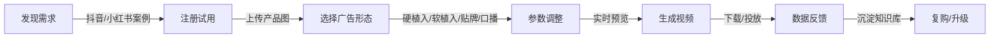

基于**"物理引擎+AI生成混合架构"**和**快速商业化**目标，为你制定以下完整PRD。此文档可直接用于研发团队执行和投资人/客户展示。

---

# EcoDream Omni 产品需求文档 (PRD)
**一站式电商广告视频生成平台**

**文档版本**：V1.0  
**日期**：2026-04-01  
**产品阶段**：MVP → 商业化  
**目标**：6个月内实现PMF（Product-Market Fit），单月收入突破50万元

---

## 1. 文档概述

### 1.1 产品背景
电商短视频广告市场爆发式增长，但内容生产存在**三高痛点**：
- **高成本**：传统TVC制作成本¥1000-5000/秒，中小商家难以承担
- **高门槛**：现有AI工具（可灵、HeyGen）需要专业剪辑知识，且无法解决"产品物理真实植入"问题
- **高耗时**：从拍摄到成片平均需要3-5天，错过热点窗口期

### 1.2 价值主张
**核心价值**：让零剪辑基础的电商运营人员，在**10分钟内**生成**物理真实、多形态、可投放**的广告视频，成本控制在**¥3-8/条**。

**一句话描述**："上传产品图，选择场景，一键生成带口播、可贴牌、物理真实的电商广告视频工厂。"

---

## 2. 目标用户与需求分析

### 2.1 核心用户画像

| 用户类型 | 占比 | 痛点 | 使用场景 | 付费意愿 |
|---------|------|------|---------|---------|
| **腰部品牌运营** | 40% | 需批量生产素材做A/B测试，但无拍摄团队 | 每周生成30-50条不同场景素材 | ¥500-2000/月 |
| **白牌电商卖家** | 35% | 无产品实拍视频，需要用AI做高质量种草 | 快速跟品，抢占流量红利 | ¥200-500/月 |
| **广告代运营公司** | 20% | 客户多、需求杂，需要标准化量产工具 | 为多个客户批量生成口播+植入视频 | ¥3000-10000/月 |
| **跨境卖家** | 5% | 需要多语言口播，寻找低成本方案 | 同一产品生成英/西/阿拉伯语版本 | ¥1000-3000/月 |

### 2.2 用户旅程地图



**关键决策点**：
- **C→D阶段**：必须提供"一键智能推荐"降低选择困难（系统根据产品类目自动推荐最佳场景）
- **E阶段**：生成时间必须<5分钟（15秒视频），否则流失率>60%

---

## 3. 产品功能架构

### 3.1 功能全景图

```
EcoDream Omni Platform
├── 核心生成引擎（Core Engine）
│   ├── 硬植入生成器（Blender+ControlNet）
│   ├── 软植入生成器（视觉分析+融合渲染）
│   ├── 贴牌替换器（SAM+Inpainting）
│   └── 口播生成器（TTS+Wav2Lip）
├── 智能编排层（Orchestration）
│   ├── 任务解析器（DAG生成）
│   ├── 时序一致性引擎（光流插值）
│   └── 多轨道合成（视频合成引擎）
├── 资产与知识库（Assets）
│   ├── 物理场景库（预渲染深度/法线资产）
│   ├── 产品特征库（用户产品3D模型/贴图）
│   └── 物理规则知识库（场景-产品适配参数）
└── 商业化层（Monetization）
    ├── SaaS订阅管理
    ├── 按次计费系统
    ├── 创作者市场（模板分成）
    └── 合规检测（广告标识/敏感内容）
```

### 3.2 详细功能模块

#### 模块A：硬植入广告生成（优先级：P0）

**功能描述**：产品作为画面主角，AI生成物理真实的背景场景。

**用户流程**：
1. **上传入口**：支持PNG/JPG（带Alpha通道透明底最佳）或OBJ/FBX（3D模型）
2. **智能场景匹配**：
   - 系统根据产品类目（美妆/3C/食品）推荐3个最佳场景（如口红→梳妆台/礼盒/户外）
   - 支持自定义：调整光照角度（柔光/硬光/侧逆光）、景别（特写/中景/全景）
3. **物理参数绑定**：
   - 自动识别产品材质（玻璃/金属/塑料），绑定对应 roughness/metallic 参数
   - 用户可微调：重量感（影响跌落/晃动动画）、反光强度
4. **生成**：
   - 系统调用Blender资产库获取对应场景的预渲染多通道图（深度/法线/粗糙度/环境光遮蔽）
   - 输入即梦AI/Stable Diffusion（ControlNet多通道条件）进行重绘
   - 关键帧生成后，光流插值补充中间帧（减少50% API调用）
5. **输出**：15秒视频（1080P/30fps），带产品物理交互（如风吹动布料、水面倒影）

**技术实现**：
- **Blender离线资产库**：预置100个高频电商场景（家居/户外/科技感），每个场景预渲染4K多通道图，存储于OSS
- **ControlNet Multi-Channel**：使用Depth+Normal+Lineart三条件控制，权重分别为1.0/0.8/0.5
- **成本优化**：同一场景+产品组合的第二次请求，直接读取缓存结果，边际成本趋近于0

**验收标准**：
- 生成时间：<3分钟（15秒视频）
- 物理真实感：用户盲测评分>4.2/5（对比纯AI生成）
- 成本：单条¥3-5（API+算力）

#### 模块B：软植入广告生成（优先级：P0）

**功能描述**：产品自然融入用户上传的真实视频中。

**用户流程**：
1. **上传视频**：支持MP4/MOV，时长15-60秒，分辨率≥720P
2. **视觉分析**：
   - 自动检测视频中的可植入位点（桌面、手部、空地）
   - 分析运动轨迹（相机运动/物体运动）和光照条件（色温/强度/方向）
3. **植入方式选择**：
   - **手持植入**：用户框选手部区域，产品自动适配手部姿态（需Canny边缘约束）
   - **桌面植入**：检测平面，产品放置并自动匹配透视
   - **背景植入**：虚化背景中的物体替换为产品
4. **物理一致性处理**：
   - 生成代理几何体（Proxy）模拟产品在视频中的物理存在
   - 光流跟踪确保产品随场景运动（解决遮挡/形变问题）
5. **融合生成**：多通道ControlNet引导，确保产品光影与场景一致

**技术实现**：
- **视觉分析**：使用YOLOv8检测物体，MediaPipe检测手部关键点，Optical Flow（RAFT算法）跟踪运动
- **时序一致性**：关键帧每5帧生成一张，中间帧光流插值+时序融合后处理（消除闪烁）

**验收标准**：
- 运动跟踪精度：像素误差<5%
- 闪烁率：<3%帧数出现明显光影跳变

#### 模块C：贴牌/换标广告（优先级：P1）

**功能描述**：识别视频中的物体（如竞品饮料瓶、墙面广告牌），替换纹理或Logo。

**用户流程**：
1. **目标选择**：用户上传视频，框选需要替换的区域（支持自动推荐：如"检测到饮料瓶，是否替换标签？"）
2. **静态贴牌**：
   - SAM（Segment Anything Model）生成精确遮罩
   - Inpainting（SDXL-Inpainting）替换纹理，保持光照一致
3. **动态贴牌**：
   - 光流跟踪目标物体运动轨迹
   - 逐帧遮罩优化（解决遮挡、形变）
   - 时序一致性重绘

**技术实现**：
- **SAM**：使用SAM 2（Segment Anything 2）视频版，支持视频序列分割
- **Inpainting**：ControlNet-Inpaint模型，结合深度图保持几何一致

**验收标准**：
- 边缘锯齿：肉眼不可见
- 动态替换连贯性：无闪烁、无漂移

#### 模块D：口播视频生成（优先级：P0）

**功能描述**：基于脚本生成数字人/真人口播，配合产品展示。

**用户流程**：
1. **文案输入**：用户输入口播文案（支持AI改写：输入卖点自动生成带货话术）
2. **形象选择**：
   - 公共数字人库（10个通用形象，分行业：美妆/3C/食品）
   - 自定义形象：上传2分钟真人视频，训练专属数字人（Lora微调，30分钟训练）
3. **语音生成**：
   - TTS：Azure Neural Voice（中文晓晓/英文Jenny），支持语气调整（热情/专业/亲切）
   - 克隆声音：上传5分钟音频克隆（可选增值服务）
4. **口型同步**：Wav2Lip或 SadTalker 实现音画同步
5. **画中画/融合**：
   - **画中画模式**：口播视频占70%屏幕，右下角30%展示产品硬植入视频（自动截取产品特写）
   - **融合模式**：产品3D模型实时叠加到口播场景（需深度图约束，技术复杂度较高，V2版本支持）

**技术实现**：
- **TTS**：Azure Speech SDK（本地缓存常用语音，减少API调用）
- **口型同步**：Wav2Lip（开源，本地部署，成本极低）
- **数字人训练**：使用SadTalker + Lora，基于用户上传视频训练专属形象

**验收标准**：
- 口型同步准确率：>90%（中文口型）
- 语音自然度：MOS评分>4.0

#### 模块E：混合广告编排（优先级：P1）

**功能描述**：一键组合硬植入+贴牌+口播，生成多版本。

**用户流程**：
1. **时间轴编辑**（简化版）：
   - 0-3秒：产品硬植入展示（视觉冲击）
   - 3-12秒：口播讲解（数字人+画中画产品演示）
   - 12-15秒：贴牌Logo展示+行动号召
2. **智能版本生成**：
   - 同一脚本生成3个版本：快节奏版（BGM快切）、慢节奏版（强调质感）、促销版（贴价格标签）
3. **自动合规**：
   - 检测是否包含"最""第一"等违禁词
   - 自动添加"广告"标识（小角标）

---

## 3.3 前端交互设计规范（新增）

### 3.3.1 核心页面流程

```
用户操作流程图：

[登录/注册] → [首页/仪表盘] → [选择广告类型] → [上传素材]
                                              ↓
[下载/投放] ← [生成等待] ← [参数调整] ← [智能场景推荐]
      ↓
[我的作品库] → [数据分析] → [再次生成/升级套餐]
```

### 3.3.2 关键页面设计

**首页/仪表盘**：
- 快速开始区：3个入口（硬植入/软植入/口播）+ 最近使用
- 使用统计：本月剩余条数、已生成视频数、节省成本估算
- 模板推荐：基于类目的热门场景推荐（滑动卡片）
- 公告区：新功能上线、优惠活动

**上传与编辑页**：
```
┌─────────────────────────────────────────────────────────────┐
│  步骤指示器：[1.上传产品] → [2.选择场景] → [3.调整参数] → [4.生成]  │
├─────────────────────────────────────────────────────────────┤
│                                                             │
│  ┌─────────────────────┐    ┌─────────────────────────────┐│
│  │                     │    │  场景推荐（智能匹配3个）      ││
│  │   产品预览区        │    │  ┌─────┐ ┌─────┐ ┌─────┐    ││
│  │   （支持缩放/旋转）  │    │  │场景1│ │场景2│ │场景3│    ││
│  │                     │    │  └─────┘ └─────┘ └─────┘    ││
│  │   [重新上传]        │    │  [查看全部100+场景]          ││
│  │                     │    │                              ││
│  └─────────────────────┘    │  参数调整                     ││
│                             │  ○ 光照：柔光 / 硬光 / 侧逆光 ││
│  素材要求提示：               │  ○ 景别：特写 / 中景 / 全景  ││
│  • 透明底PNG最佳             │  ○ 氛围：简约 / 奢华 / 活力  ││
│  • 分辨率≥512x512           │                              ││
│  • 文件<10MB                │  [实时预览] [一键智能优化]    ││
│                             │                              ││
└─────────────────────────────────────────────────────────────┘
```

**生成等待页**：
- 进度条+百分比实时更新
- 当前步骤文字提示（如"AI正在分析产品材质..."）
- 预计剩余时间
- 后台生成选项（允许离开页面，完成通知）
- 趣味内容（生成技巧、成功案例展示）

**结果预览页**：
- 视频播放器（支持倍速、全屏、下载）
- 多版本对比（同脚本不同风格并排对比）
- 编辑按钮（重新调整参数再生成）
- 分享按钮（复制链接、下载二维码）
- 满意度评价（1-5星）

### 3.3.3 交互状态设计

**加载状态**：
| 场景 | 视觉反馈 | 文字提示 |
|------|---------|---------|
| 上传中 | 进度环+文件图标动画 | "正在上传产品图..." |
| 分析中 | 产品图+扫描线特效 | "AI正在识别产品..." |
| 生成中 | 进度条+步骤指示 | "正在生成第3帧/共15帧..." |
| 合成中 | 胶片卷轴动画 | "正在合成最终视频..." |

**空状态**：
- 无作品：插画+文字"还没有作品，点击开始创作第一条视频"+CTA按钮
- 无场景匹配："暂无匹配场景，尝试上传更清晰的产品图"+人工客服入口
- 生成失败：错误原因+重试按钮+客服联系

**错误状态**：
```
错误提示设计原则：
1. 清晰说明问题（非技术语言）
2. 提供解决方案（ actionable ）
3. 提供备用选项
4. 严重错误提供客服入口

示例：
❌ 错误代码：ERR_API_TIMEOUT
✅ "生成超时了，可能是网络波动。已自动重试，如仍失败请[联系客服]"
```

### 3.3.4 响应式设计规范

**断点定义**：
| 设备 | 宽度 | 布局调整 |
|------|------|---------|
| 桌面端 | >1280px | 双栏布局，左侧预览右侧设置 |
| 平板端 | 768-1280px | 单栏布局，设置区折叠 |
| 移动端 | <768px | 单栏布局，底部固定操作栏 |

**移动端适配**：
- 上传支持拍照直接上传
- 场景选择改为横向滑动卡片
- 生成进度支持推送通知（微信小程序/APP）
- 简化参数调整（默认智能推荐，高级选项折叠）

### 3.3.5 设计系统（Design System）

**色彩规范**：
```
主色调：#1890FF（科技蓝）
辅助色：#52C41A（成功绿）、#FAAD14（警告黄）、#F5222D（错误红）
中性色：#262626（主文字）、#595959（次要文字）、#BFBFBF（禁用）
背景色：#F5F5F5（页面背景）、#FFFFFF（卡片背景）
```

**字体规范**：
- 中文：PingFang SC（苹果）/ Microsoft YaHei（Windows）
- 英文：Inter / SF Pro Display
- 字号：标题24px、正文16px、辅助14px、标签12px

**组件库**：基于 Ant Design / Element Plus 定制

---

## 4. 技术实现方案（详细架构）

### 4.1 系统架构图

```
┌─────────────────────────────────────────────────────────────┐
│                      前端层 (Web/App)                       │
│  React/Vue + WebGL预览 + 视频播放器 + 支付/订阅管理         │
└───────────────────────┬─────────────────────────────────────┘
                        │
┌───────────────────────▼─────────────────────────────────────┐
│                     API Gateway                              │
│  限流/鉴权/日志 + 任务分发队列 (RabbitMQ/Kafka)             │
└───────────────────────┬─────────────────────────────────────┘
                        │
        ┌───────────────┼───────────────┐
        │               │               │
┌───────▼──────┐ ┌──────▼──────┐ ┌──────▼──────┐
│  硬植入服务   │ │  软植入服务  │ │  口播服务   │
│  Blender资产 │ │  视觉分析    │ │  TTS本地   │
│  ControlNet  │ │  光流跟踪    │ │  Wav2Lip   │
└───────┬──────┘ └──────┬──────┘ └──────┬──────┘
        │               │               │
        └───────────────┼───────────────┘
                        │
        ┌───────────────▼────────────────┐
        │      编排与合成服务              │
        │  DAG调度 + 时序一致性引擎       │
        │  FFmpeg多轨道合成               │
        └───────────────┬────────────────┘
                        │
        ┌───────────────▼────────────────┐
        │       资产与知识库层           │
        │  OSS存储 + 物理规则库(PostgreSQL)│
        │  Redis缓存(热门组合)            │
        └────────────────────────────────┘
```

### 4.2 关键技术栈

| 模块 | 技术选型 | 理由 | 成本控制 |
|------|---------|------|---------|
| **Blender资产渲染** | Blender 4.0 + Python API | 开源，支持Cycles/EEVEE双引擎 | 离线渲染，无运行时成本 |
| **AI生成引擎** | 即梦AI API / Stable Diffusion XL | 国内合规，效果稳定 | 硬植入关键帧生成，成本¥0.5/帧 |
| **ControlNet** | ControlNet 1.1 (Multi-input) | 支持Depth+Normal+Lineart多条件 | 本地部署，仅消耗GPU算力 |
| **视觉分析** | YOLOv8 + MediaPipe + RAFT | 开源，实时性好 | 本地推理，成本极低 |
| **TTS** | Azure Neural Voice (East Asia) | 中文语音质量最佳 | 标准版¥0.5/千字符，本地缓存常用语音 |
| **口型同步** | Wav2Lip (开源优化版) | 支持中文，CPU可实时运行 | 本地部署，零API成本 |
| **视频合成** | FFmpeg + Python MoviePy | 成熟稳定，支持复杂滤镜 | 轻量CPU实例即可 |
| **数据存储** | 阿里云OSS + RDS PostgreSQL + Redis | 冷热分层，知识库结构化存储 | OSS存储成本¥0.12/GB/月 |

### 4.3 成本结构详细测算（核心指标）

**单条15秒混合广告（硬植入3秒+口播12秒）成本拆解**：

| 成本项 | 计算方式 | 单价 | 次数 | 小计 |
|--------|---------|------|------|------|
| **硬植入关键帧** | 即梦AI文生图（512x512） | ¥0.015 | 5帧（每秒1关键帧+光流插值） | ¥0.075 |
| **ControlNet推理** | 本地GPU（A10）分摊 | ¥0.05/分钟 | 0.5分钟 | ¥0.025 |
| **软植入/贴牌** | 若涉及，SAM+Inpainting | ¥0.02 | 10帧 | ¥0.20 |
| **TTS** | Azure Neural，15秒约50字 | ¥0.0005/字 | 50字 | ¥0.025 |
| **Wav2Lip** | 本地CPU推理 | ¥0.01 | 1 | ¥0.01 |
| **视频合成** | FFmpeg转码 | ¥0.005 | 1 | ¥0.005 |
| **存储/带宽** | OSS临时存储 | ¥0.02 | 1 | ¥0.02 |
| **合计** | | | | **¥0.36/条** |

**商业成本目标**：考虑到缓存命中、失败重试、运营损耗，**对外报价¥8/条，实际成本控制在¥3以内，毛利率>60%**。

**规模化后的边际成本**：
- 热门场景（如"美妆-梳妆台"）缓存命中率达70%，边际成本降至¥1/条
- 口播部分完全本地化处理（TTS缓存+Wav2Lip本地），不受API涨价影响

---

## 5. 商业化策略

### 5.1 定价体系（SaaS+按次混合）

**免费版（Freemium）**：
- 每月3条免费生成（带平台水印）
- 基础场景库（20个场景）
- 720P输出

**基础版（¥199/月）**：
- 每月30条（¥6.6/条）
- 硬植入+口播基础功能
- 1080P输出，去水印
- 公共数字人库

**专业版（¥599/月）**：
- 每月100条（¥6/条）
- 软植入+贴牌功能解锁
- 自定义数字人训练（1个形象/月）
- 优先生成队列（<2分钟）

**企业版（¥2999/月起）**：
- 无限条数（或500条/月）
- 批量生成工具（Excel导入100个SKU，自动生成视频）
- API接口（支持接入客户自有ERP/广告系统）
- 私有化部署选项（+¥5000/月）

**增值服务**：
- 超出套餐：¥10/条（鼓励升级套餐而非单买）
- 自定义数字人训练：¥199/次
- 声音克隆：¥99/次
- 4K超清导出：¥2/条

### 5.2 创作者市场（生态构建）

**模板创作者**：
- 头部创作者上传真实拍摄视频作为"可植入场景"，设置植入位点
- 其他用户使用该模板生成广告，创作者获得¥0.5-2/次分成
- 平台抽成20%

**数字人创作者**：
- 模特/主播上传形象授权，训练公共数字人
- 用户使用其形象生成视频，创作者获得¥0.3/次分成

**壁垒价值**：创作者生态形成网络效应，用户因模板丰富度留存，创作者因收益不迁移，双向锁定。

---

## 6. 项目实施路线图（现实版）

**总周期：5个月（20周）**，分三个阶段：

### Phase 1：MVP验证（Week 1-6）
**目标**：验证核心假设（硬植入+口播组合是否有付费意愿）

**关键交付**：
- Week 1-2：Blender资产库建设（30个高频场景），ControlNet多通道调通
- Week 3-4：Web端MVP（上传→选择场景→生成→下载）
- Week 5-6：口播模块接入（Azure TTS + Wav2Lip），实现"硬植入+口播"混合生成

**成功指标**：
- 内测用户50人，生成视频200条，付费转化率>10%
- 单条生成时间<5分钟，成本<¥5

**资源需求**：
- 2名后端（Python+AI），1名前端，1名3D设计师（场景制作）

### Phase 2：产品化与商业化（Week 7-14）
**目标**：上线SaaS订阅体系，实现首批付费客户

**关键交付**：
- Week 7-8：软植入功能（视觉分析+光流跟踪），贴牌功能（SAM+Inpainting）
- Week 9-10：支付系统接入（支付宝/微信）、订阅管理后台
- Week 11-12：时序一致性引擎优化（消除闪烁），混合广告编排功能
- Week 13-14：创作者市场MVP（模板上传/审核/分成）

**成功指标**：
- 注册用户1000+，付费用户100+，MRR（月经常性收入）>¥5万
- NPS（净推荐值）>30

**资源需求**：
- 增加1名产品经理，1名运营（创作者招募），1名客服

### Phase 3：规模化与生态（Week 15-20）
**目标**：建立数据飞轮，实现盈利

**关键交付**：
- Week 15-16：物理规则知识库上线（自动推荐植入参数），A/B测试工具（多版本生成）
- Week 17-18：API开放平台（吸引代运营公司接入），合规检测自动化
- Week 19-20：企业版销售（重点攻克3-5个年预算10万+的品牌客户）

**成功指标**：
- MRR >¥50万，毛利率>60%
- 资产复用率>50%（证明飞轮效应启动）

---

## 6.5 运营支持与数据分析后台（新增）

### 6.5.1 运营支持系统

**客服工单系统**：
- 智能客服机器人（基于知识库自动回复常见问题）
- 人工客服接入（工单分级：P0生成失败/P1功能咨询/P2建议反馈）
- 问题追踪与闭环（48小时内响应，生成失败问题2小时内解决）

**用户反馈收集**：
- 应用内反馈入口（截图标注功能，方便用户描述问题）
- 生成质量评分（1-5星评价，低于3星强制填写原因）
- NPS调研（月度邮件调研，赠送优惠券激励）
- 用户访谈招募（高价值用户月度访谈，¥200/次）

**内容审核系统**：
- AI预审（敏感内容识别，涉黄/涉暴/政治敏感）
- 人工复审（创作者上传模板审核，2小时内完成）
- 用户举报通道（侵权/低质量内容举报，24小时处理）

### 6.5.2 数据分析后台

**核心数据仪表盘**：
| 指标维度 | 具体指标 | 更新频率 | 告警阈值 |
|---------|---------|---------|---------|
| **生成质量** | 成功率、平均生成时长、失败原因分布 | 实时 | 成功率<95%告警 |
| **用户行为** | 日活/月活、功能使用率、漏斗转化率 | 实时 | DAU下降>20%告警 |
| **商业指标** | MRR、付费转化率、客单价、LTV/CAC | 每日 | MRR周增长<5%告警 |
| **成本指标** | 单条成本、API调用费用、GPU利用率 | 每小时 | 单条成本>¥5告警 |

**用户分群分析**：
- 高价值用户（月生成>100条）：专属客服，优先体验新功能
- 流失预警用户（7天未登录）：自动触发优惠券推送
- 新手用户（注册<7天）：强制引导完成首条视频生成

---

## 6.6 用户体验优化策略（新增）

### 6.6.1 异步生成体验

**生成进度可视化**：
```
用户界面状态流转：

[上传产品图] → [分析中... 10%] → [场景匹配... 25%] 
      ↓
[生成关键帧... 50%] → [时序渲染... 75%] → [最终合成... 90%]
      ↓
[✅ 生成完成] / [❌ 生成失败 - 查看原因]
```

**等待体验优化**：
- 预计剩余时间显示（基于历史数据动态计算）
- 生成过程趣味提示（"AI正在调整光影..."、"正在优化产品边缘..."）
- 后台生成通知（离开页面后，通过微信/邮件通知完成）
- 排队机制（高峰期显示排队位置，VIP用户优先队列）

### 6.6.2 失败处理与重试

**失败分类与处理**：
| 失败类型 | 自动重试 | 用户提示 | 补偿机制 |
|---------|---------|---------|---------|
| API超时 | 3次 | "网络波动，正在重试..." | 自动重试不计费 |
| 生成质量不达标 | 1次 | "正在优化生成效果..." | 使用备用模型 |
| 产品图识别失败 | 0次 | "请上传更清晰的产品图" | 赠送1次免费次数 |
| 服务器错误 | 立即 | "系统繁忙，请稍后重试" | 赠送3次免费次数 |

**用户自主修复引导**：
- 产品图模糊 → 提供"一键增强"功能
- 场景不匹配 → 推荐3个替代场景
- 口播不同步 → 提供重新生成口播选项

### 6.6.3 新手引导与帮助系统

**渐进式引导**：
- 首次登录：强制引导完成"首条视频生成"（赠送免费次数）
- 功能解锁：新功能上线时，气泡提示引导使用
- 高级功能：专业版功能限时试用（3条免费体验）

**帮助中心**：
- 视频教程库（每个功能2-3分钟操作视频）
- FAQ知识库（100+常见问题，支持搜索）
- 社区论坛（用户交流、案例分享、问题求助）

---

## 6.7 国际化与多语言方案（新增）

### 6.7.1 多语言支持计划

**第一阶段（MVP）**：中文简体、中文繁体、英文
**第二阶段（Month 6-12）**：日文、韩文、西班牙文、阿拉伯文
**第三阶段（Month 12+）**：法文、德文、葡萄牙文、俄文

### 6.7.2 跨境本地化适配

| 地区 | 本地化内容 | 技术适配 |
|------|-----------|---------|
| **中国大陆** | 抖音/快手/B站格式，中文TTS | 阿里云OSS、国内CDN |
| **港澳台** | 繁体中文，YouTube/Instagram格式 | 香港CDN节点 |
| **东南亚** | 本地化场景模板（热带风情） | 新加坡服务器 |
| **中东** | 阿拉伯语RTL界面，宗教合规 | 迪拜服务器 |
| **欧美** | GDPR合规，英语/西班牙语TTS | AWS美东/欧西节点 |

### 6.7.3 跨境合规要求

**GDPR合规（欧盟）**：
- 用户数据可导出（机器可读格式）
- 数据删除权（一键删除所有个人数据）
- 隐私同意管理（ granular consent，非默认勾选）
- DPO（数据保护官）任命

**数据本地化**：
- 中国大陆用户数据存储在境内（阿里云杭州/北京）
- 欧盟用户数据存储在欧盟境内（AWS法兰克福）
- 数据跨境传输需用户明确同意

---

## 7. 风险识别与应对

### 7.1 技术风险（增强）

| 风险类型 | 具体风险 | 概率 | 影响 | 应对策略 |
|---------|---------|------|------|---------|
| **技术风险** | ControlNet多条件控制失效，生成质量不达预期 | 中 | 高 | 准备Plan B：切换至IPAdapter+Reference-only模式，降低物理精度但保证可用性 |
| **技术风险** | 光流跟踪算法在快速运动场景失效 | 中 | 中 | 限制上传视频运动速度（提示用户），研发更鲁棒的跟踪算法 |
| **技术风险** | GPU服务器故障导致服务中断 | 低 | 高 | 多可用区部署，自动故障转移，备用云GPU实例（阿里云/AWS双保险） |
| **成本风险** | 即梦AI等API涨价，导致成本突破¥8/条 | 中 | 高 | 自建Stable Diffusion集群（A100*4），当使用量>500条/天时切换，固定成本摊薄 |
| **第三方依赖** | 即梦AI/微软Azure服务停服或限制访问 | 低 | 高 | 多供应商策略（即梦+Midjourney+自建SD），API降级方案（本地备用模型） |
| **第三方依赖** | 开源组件（Wav2Lip/ControlNet）协议变更 | 低 | 中 | 定期审查开源协议，核心代码自主化（V2版本），法律顾问审核 |
| **合规风险** | 口播数字人涉及深度伪造监管，平台要求标识 | 高 | 中 | 产品内强制添加"数字人生成"角标，建立真人形象授权审核机制 |
| **合规风险** | 版权争议（场景素材/背景音乐侵权） | 中 | 高 | 所有素材原创或购买商用授权，用户上传素材版权声明，侵权投诉处理流程 |
| **合规风险** | 广告法违规（用户生成违禁内容） | 中 | 中 | AI预审+人工抽检，用户协议明确责任归属，提供合规检测工具 |
| **竞争风险** | 快手可灵/阿里妈妈推出类似功能且免费 | 高 | 高 | **差异化定位**：不做通用视频生成，专注"产品物理植入"细分场景，做深做透；与大厂寻求API合作而非竞争 |
| **数据风险** | 用户产品3D模型泄露（商业机密） | 低 | 高 | 数据加密存储（AES-256），签署保密协议，提供私有化部署选项给敏感客户 |
| **数据风险** | 数据库故障导致数据丢失 | 低 | 高 | 每日自动备份，异地容灾，RTO<4小时，RPO<1小时 |
| **运营风险** | 核心技术人员离职 | 中 | 高 | 股权激励，知识文档化，代码所有权归属公司，竞业禁止协议 |
| **运营风险** | 创作者市场冷启动失败 | 中 | 中 | 种子创作者签约保底，官方自制模板填充，创作者激励计划 |

### 7.2 灾难恢复与业务连续性（新增）

**灾备目标**：
- **RTO**（恢复时间目标）：< 4小时
- **RPO**（恢复点目标）：< 1小时

**备份策略**：
| 数据类型 | 备份频率 | 保留周期 | 存储位置 |
|---------|---------|---------|---------|
| 用户数据（PostgreSQL） | 每小时增量，每日全量 | 30天 | 主库+异地备库 |
| 对象存储（OSS/S3） | 跨区域复制 | 永久 | 主区域+备份区域 |
| 代码/配置 | 每次提交 | 永久 | GitHub + 自托管Git |
| 模型权重 | 每周 | 版本保留 | NAS + 云存储 |

**故障场景应对**：
```
故障等级定义：
P0（严重）：服务完全不可用，所有用户受影响
  → 立即启动应急预案，15分钟内响应，4小时内恢复
  
P1（高）：核心功能不可用，部分用户受影响
  → 30分钟内响应，8小时内恢复，启用降级模式
  
P2（中）：非核心功能异常
  → 2小时内响应，24小时内修复
  
P3（低）：轻微体验问题
  → 下一个版本修复
```

---

## 8. 测试策略与质量保证（新增）

### 8.1 测试金字塔

```
        ┌─────────┐
        │  E2E测试 │  ← 关键用户流程自动化测试（Cypress/Playwright）
        │  (10%)  │     覆盖：上传→生成→下载完整链路
        ├─────────┤
        │ 集成测试 │  ← 服务间接口测试（API自动化）
        │  (20%)  │     覆盖：各生成模块编排逻辑
        ├─────────┤
        │ 单元测试 │  ← 函数/组件级别测试（Jest/Pytest）
        │  (70%)  │     覆盖：核心算法、工具函数
        └─────────┘
```

### 8.2 AI生成质量测试

**自动化质量评估**：
| 评估维度 | 测试方法 | 通过标准 |
|---------|---------|---------|
| **物理一致性** | 对比生成帧深度图与场景深度图 | SSIM>0.85 |
| **时序连贯性** | 光流连续性检测 | 光流误差<5% |
| **口型同步** | 语音-口型对齐度检测 | 同步率>90% |
| **无闪烁** | 帧间颜色直方图差异 | 差异<10% |
| **无伪影** | 边缘检测+人工抽检 | 无肉眼可见伪影 |

**人工评估流程**：
- 每周抽检100条生成视频，3人盲评
- 评分维度：物理真实感（1-5）、美观度（1-5）、商用可用性（是/否）
- 评分<3分的视频，触发模型优化迭代

### 8.3 A/B测试框架

**可测试变量**：
- 场景推荐算法（A: 基于类目 / B: 基于协同过滤）
- 定价页面（A: 功能对比 / B: 价格锚定）
- 生成等待页面（A: 进度条 / B: 趣味动画）
- 新手引导（A: 强制引导 / B: 自主选择）

**实验流程**：
1. 设定假设（如"趣味动画能降低20%跳出率"）
2. 分流（50/50或90/10灰度）
3. 运行实验（至少2周或1000样本）
4. 分析结果（统计显著性p<0.05）
5. 决策（全量/回滚/迭代）

---

## 9. 法律合规详细条款（新增）

### 9.1 用户协议与责任界定

**用户责任**：
- 保证上传产品图/视频拥有合法权利（原创或已获授权）
- 不得生成违法违规内容（虚假宣传、违禁品广告）
- 数字人形象需提供肖像权授权书

**平台责任**：
- 保证服务可用性（月度SLA≥99.5%）
- 保护用户数据安全（加密存储、不用于训练）
- 提供生成内容合规检测工具

**免责条款**：
- 因用户上传素材侵权导致的法律责任由用户承担
- 因不可抗力（自然灾害、战争）导致的服务中断
- 第三方API服务故障导致的生成失败

### 9.2 知识产权保护

**平台知识产权**：
- 平台代码、算法、场景模板归公司所有
- 用户协议明确授予用户使用生成视频的永久许可

**用户知识产权**：
- 用户上传的原始素材知识产权归用户所有
- 生成视频的知识产权归用户所有（付费用户）/ 平台共享（免费用户带水印）

**创作者知识产权**：
- 创作者上传的模板，平台获得非独家使用权
- 创作者保留模板的所有权，可自由在其他平台使用

### 9.3 合规认证计划

| 认证 | 时间 | 目的 |
|------|------|------|
| **等保三级**（中国） | Month 6 | 政府/国企客户准入 |
| **ISO 27001** | Month 12 | 信息安全管理国际标准 |
| **GDPR合规审计** | Month 12 | 欧盟市场准入 |
| **SOC 2 Type II** | Month 18 | 美国企业客户信任背书 |

---

## 10. 成功指标（OKR体系）

### O1：成为电商短视频生成工具TOP3（6个月内）

### O1：成为电商短视频生成工具TOP3（6个月内）
**KR1**：注册用户达到5000人，DAU（日活）>800  
**KR2**：付费转化率>8%，MRR>¥50万，客单价>¥400/月  
**KR3**：NPS>40，客户留存率（3个月）>60%

### O2：建立可防御的技术-数据壁垒（6个月内）
**KR1**：物理场景库覆盖200个高频电商场景，用户自定义场景<20%（证明标准化成功）  
**KR2**：场景-产品知识库沉淀10000条有效配对数据，新用户冷启动推荐准确率>70%  
**KR3**：资产复用率（缓存命中率）>60%，边际成本降至¥1.5/条以下

### O3：构建创作者生态雏形（6个月内）
**KR1**：入驻模板创作者>50人，提供>100个优质可植入模板  
**KR2**：创作者分成支出>¥2万/月，证明生态造血能力  
**KR3**：通过创作者渠道获取用户占比>20%

---

## 11. 附录：术语表与参考文档

**术语表**：
- **硬植入**：产品作为3D模型置入虚拟场景
- **软植入**：产品融入用户上传的真实视频
- **ControlNet**：通过深度图/法线图等条件控制AI生成内容的扩散模型插件
- **Wav2Lip**：基于语音驱动唇形同步的开源算法
- **SAM**：Meta开源的Segment Anything Model，用于图像分割

**参考文档**：
- 《Blender Python API文档》（资产自动化渲染）
- 《ControlNet官方Paper：Adding Conditional Control to Text-to-Image Diffusion Models》
- 《Azure Neural Voice服务级别协议》
- 《电商广告法合规指南》（国家市场监管总局2024版）

---

**PRD签署**：  
产品负责人：___________  
技术负责人：___________  
日期：2026-04-01

---

## 文档变更记录

| 版本 | 日期 | 变更内容 | 作者 |
|------|------|---------|------|
| V1.0 | 2026-04-01 | 初始版本 | - |
| V1.1 | 2026-04-01 | 新增：运营支持系统、数据分析后台、用户体验优化、国际化方案、灾难恢复、测试策略、法律合规 | - |

---

此PRD可直接作为研发排期依据（建议用Jira/飞书项目拆解为User Story）和融资BP的产品章节。建议**立即启动Phase 1**，用6周MVP验证市场需求，再决定是否投入后续资源。